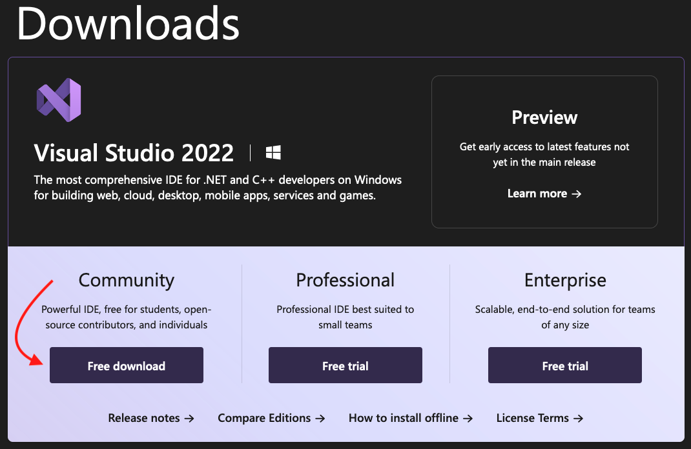

Getting Set Up
==============

1. [Mac and Linux](#mac-and-linux)
2. [Windows](#windows)
   1. [Windows Build Tools](#windows-build-tools)
   2. [Rustup](#rustup)
   3. [GCC (optional, but recommended)](#gcc-optional-but-recommended)

Mac and Linux
-------------

Before you begin, you need to make sure you have the appropriate build tools.

For Mac, make sure to run `xcode-select install`

For Linux, you need to install gcc via your package manage, for example, on a Raspberry Pi, you might do 
`sudo apt install gcc`

Go to [https://rustup.rs](https://rustup.rs), copy the command displayed there into your terminal.


You will be given the option for customizing the installation, but we don't need to do that for now

```sh
$ curl --proto '=https' --tlsv1.2 -sSf https://sh.rustup.rs | sh

# [other information about the install appears here]

Current installation options:


   default host triple: x86_64-apple-darwin
     default toolchain: stable (default)
               profile: default
  modify PATH variable: yes

1) Proceed with installation (default)
2) Customize installation
3) Cancel installation
>
```

Choose 1 and wait for installation to complete. To immediately use Rust's tools now, you will need to run the command it
tells you to run at the end of the installer, however, you should only need to do this once as the installer makes the
changes necessary for new terminal sessions to pick up on the changes.

```shell
$ source "$HOME/.cargo/env"
```

Now you can check whether everything has installed properly by running `cargo version` and you should see something
like this:

```shell
$ cargo version
cargo 1.75.0 (1d8b05cdd 2023-11-20)
```

Cargo is the main tool we'll use to build and work with Rust, you will need at least version `1.75` for this tutorial.

Windows
-------

Installing Rust on Windows is a bit more challenging, but you've got this, I believe in you.

All the important differences for Windows are explained on [rustup.rs](https://rustup.rs), however, I personally
struggled a bit with this, so I'm laying it out here in my own words.

### Windows Build Tools

The first thing we're going to need are some Microsoft build tools. 

Head to [https://visualstudio.microsoft.com/downloads/](https://visualstudio.microsoft.com/downloads/) and download the 
community edition.



The installer is the gateway to a huge number of tools and software, but we only need two things.

Click through to the Individual Components tab, and search for the following: `C++ x64/x86 build tools`

Select the latest version.

Next search for: `Windows SDK`

Select the latest version of the SDK for your version of Windows.

Finally, click install. You may get a prompt asking if you'd like to continue without workloads, which you do,
so continue.

The installation itself can take a while so grab a tea or something ☕

### Rustup

Once the Windows build tools are installed, head back to [rustup.rs](https://rustup.rs) and download `rustup-init.exe`.
Running this will install the tools we need.

Choose the default install options.

Once complete, we can check that things have been installed correctly by opening either `cmd` or `powershell` or your
terminal of choice, and run:

```shell
cargo version
```

### GCC (optional, but recommended)

Wait, the rustup website doesn't mention this!

I know, and you don't _necessarily_ need to do this. However, Rust is a language that can interop with other languages.
In particular, Rust works really well with existing C and C++ libraries, however, Windows and Linux us different C++
libraries. This can be fixed by installing `gcc`.

Like Microsoft's build tools, gcc isn't packaged by itself, but unlike Microsoft's build tools there are many, many ways
to install it.

The easiest way I've found is to install the [Scoop](https://scoop.sh) package manager by following the instructions on
their website.

Once installed, all you need to do is run:

```shell
scoop install main/gcc
```

You can check this worked by running `gcc --version`

Phew! That's it, congratulations! It took me over an hour to do this on my first attempt.

If you haven't done already, its a good idea to restart your computer before moving on.
