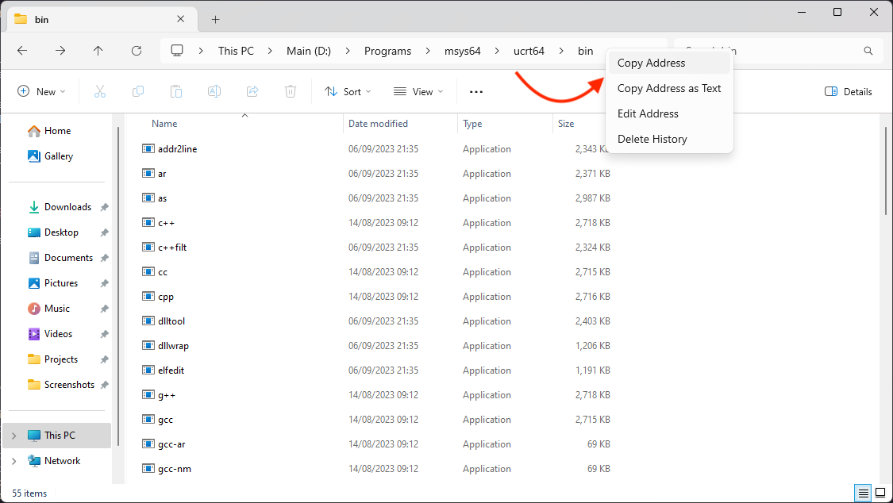
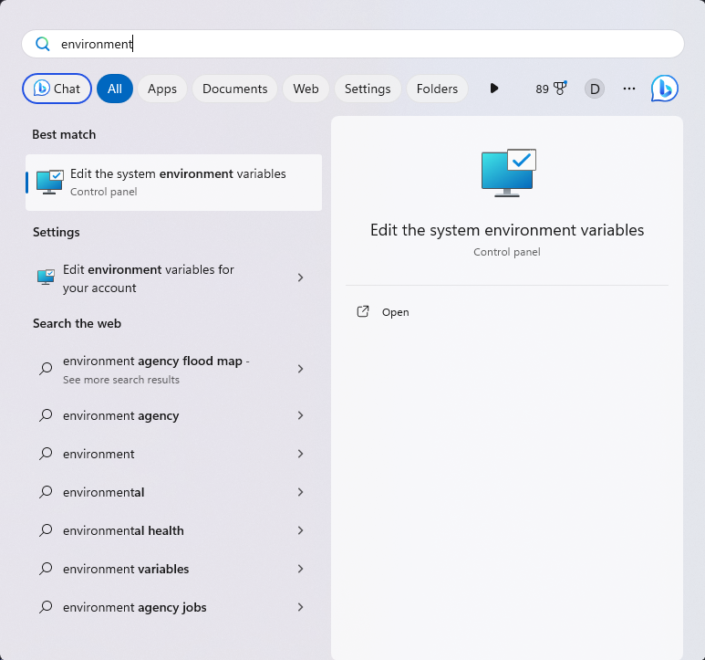
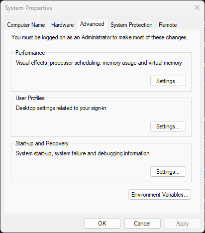
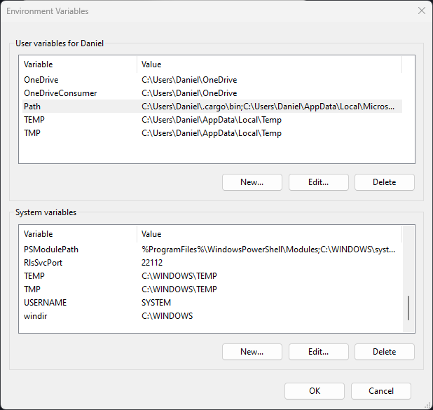
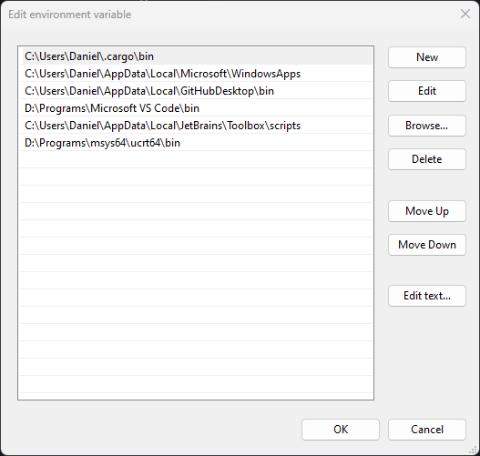

Why or Why Not, Installation and Hello World
============================================

1. [Mac and Linux](#mac-and-linux)
2. [Windows](#windows)
   1. [Windows Build Tools](#windows-build-tools)
   2. [Rustup](#rustup)
   3. [GCC (optional, but recommended)](#gcc-optional-but-recommended)

Mac and Linux
-------------

Go to [https://rustup.rs](https://rustup.rs), copy the command displayed there into your terminal.


You will be given the option for customizing the installation, but we don't need to do that for now

```sh
$ curl --proto '=https' --tlsv1.2 -sSf https://sh.rustup.rs | sh

# [other information about the install appears here]

Current installation options:


   default host triple: x86_64-apple-darwin
     default toolchain: stable (default)
               profile: default
  modify PATH variable: yes

1) Proceed with installation (default)
2) Customize installation
3) Cancel installation
>
```

Choose 1 and wait for installation to complete. To immediately use rusts tools now, you will need to run the command it
tells you to run at the end of the installer, however, you should only need to do this once as the installer makes the
changes necessary for new terminal sessions to pick up on the changes.

```shell
$ source "$HOME/.cargo/env"
```

Now you can check whether everything has installed properly by running `cargo version` and you should see something
like this:

```sh
$ cargo version
cargo 1.75.0 (1d8b05cdd 2023-11-20)
```

Cargo is the main tool we'll use to build and work with Rust, you will need at least version `1.75` for this tutorial.

Windows 11
----------

Running Rust on Windows is a bit more challenging, but you've got this, I believe in you.

All the important differences for Windows are explained on [rustup.rs](https://rustup.rs), however, I personally
struggled a bit with this, so I'm laying it out here in my own words.

### Windows Build Tools

The first thing we're going to need are some Microsoft build tools. 

Head to [https://visualstudio.microsoft.com/downloads/](https://visualstudio.microsoft.com/downloads/) and download the 
community edition.

== Add Screenshot ==

The installer is the gateway to a huge number of tools and software, but we only need two things.

Click through to the Individual Components tab, and search for the following: `C++ x64/x86 build tools`

Select the latest version.

Next search for: `Windows 11 SDK`

Again, select the latest version.

Finally, click install. You may get a prompt asking if you'd like to continue without workloads, which you do,
so continue.

The installation itself can take a while so grab a tea or something ☕

### Rustup

Once the Windows build tools are installed, head back to [rustup.rs](https://rustup.rs) and download `rustup-init.exe`.
Running this will install the tools we need.

Choose the default install options.

Once complete, we can check that things have been installed correctly by opening either `cmd` or `powershell` or your
terminal of choice, and run `cargo version`.

### GCC (optional, but recommended)

Wait, the rustup website doesn't mention this!

I know, and you don't _necessarily_ need to do this. However, Rust is a language that can interop with other languages.
In particular, Rust works really well with existing C and C++ libraries, however, Windows and Linux us different C++
libraries. This can be fixed by installing `gcc`.

Like Microsoft's build tools, gcc isn't packaged by itself, but unlike Microsoft's build tools there are many, many ways
to install it.

The easiest way I've found is to install [MSYS2](https://www.msys2.org/), with two caveats. This will install more than
we need... and the installer doesn't quite do everything you need. Don't worry, we'll step through it.

> 🙏🏻 If anyone knows of a friendlier way of achieving this, please do open a PR or Issue 
> [on this projects repository](https://github.com/Gisleburt/idiomatic-rust-in-simple-steps)

First, grab the installer and follow the instruction. MSYS2 is a little fussy about where its installed, if in doubt
install it in the default location. Wherever you install it though, keep it in mind, we'll need to find it shortly.

After installation but before we go further, we want to allow ourselves access to the tools that we're going to install
inside MSYS2. To do that, you'll need to find where it was installed, then go to the `ucrt64` directory, and then `bin`.
Copy the full path to this directory. Note, I installed mine to `D:/Programs/MYSYS64` but by default it will be `C:/MYSYS64`



== Add more arrows ==

Next we need to add this to a system environment variable called `PATH`, this will allow us to access any tools in that
directory from anywhere in our system. To do this, go to the start menu, and simply type "environment" then click
"Edit the system environment variables"



This, weirdly, doesn't take you straight to environment variables but to system properties where you can click through
to the Environment variables at the bottom.


<div class="warning">
Be careful here and don't change anything other than what we're here to change. Luckily the UI around this is very
sensible these days making it much harder to mess up.
</div>

Select the Path variable in the top box, then hit edit.



Now hit New on the right, and paste in the path as you can see I have done below



Click OK to save the new path.

Finally we're ready to install gcc. Run the application `MSYS2 UCRT64` from the start menu. This is a specific
environmental setup for MSYS and will be the easiest to perform the next step in.

Enter the command `pacman -S mingw-w64-ucrt-x86_64-gcc`, hitting `<enter>` when it asks for confirmation. Pacman is the
package manager for MSYS and will install `gcc` and all of its dependencies.

You can check this worked by running `gcc --version`

Phew! Thats it, congratulations! It took me over an hour to do this on my first attempt.

If you haven't done already, its a good idea to restart your computer before moving on.
