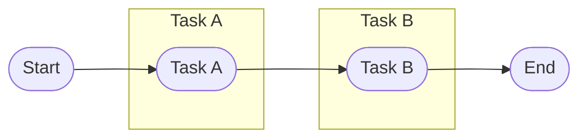
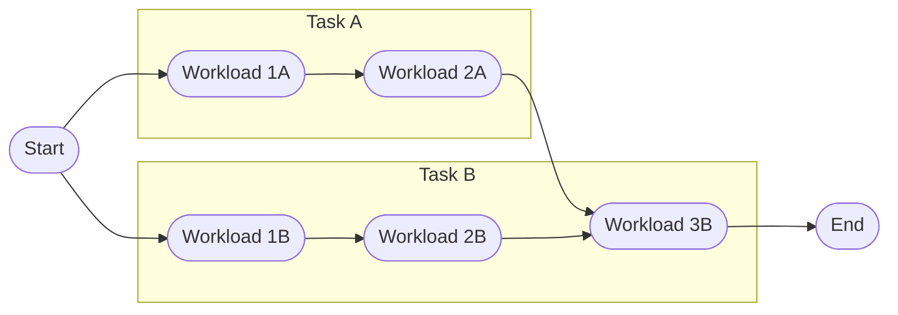

Async Rust
==========

Often times, when we write code, we have to wait on certain "things" to happen. "Things" are often some form of IO, such
as reading or writing to a disk, getting data from a database, downloading a file, etc. Sometimes the "thing" could just
be computationally expensive, such as processing large amounts of data.

Our programs are typically complex with multiple parts to them. For example, applications often have a user interface,
whether that's via a terminal, a web page, or a full desktop GUI. If our application has to wait on something happening,
we don't want other aspects (like the UI) to freeze up, unable to do anything while we wait.

Asynchronous programming is a way to structure our code so that we can do work when nothing else is happening, and it
doesn't depend on any specific way to get the work done. Under the hood, we might use threads, or we may depend on 
Operating System hooks or even for embedded programming, hardware interrupts, and exceptions.

In this chapter we're going to explain the modular design of async programming in Rust. Our aim is to get a solid(ish)
understanding of the concepts involved, even though, in the real world, you're likely to depend on others to design and
build the more complex parts.

In fact, I've simplified this chapter beyond real-world usefulness; it's just here to explain the concepts. Please don't
use any of this in a real application!

Move and Pin
------------

Before we go further into the chapter, we once again need to talk about memory, moving, and pinning.

All data in our running program exists somewhere in memory, whether it's the stack, the heap, or static memory. That
means that everything has a pointer address in memory. 

When we do something like pass a variable to another function, ownership of that variable "moves" to the other function.
If we do something like add a variable to a `Vec` then ownership of that variable "moves" to the heap. When data "moves"
ownership, it also physically moves in memory. 

Run this and look closely at the returned addresses.

```rust
fn example_move(hello: String) {
    let hello_ptr = &raw const hello;
    println!("Hello is stored at {hello_ptr:p}");
}

fn main() {
    let hello = "Hello".to_string();
    
    let hello_ptr = &raw const hello;
    println!("Hello is stored at {hello_ptr:p}");
    
    example_move(hello);
}
```

Because `example_move` takes ownership of the String, and as we learned in the [unsafe](./unsafe) chapter, the metadata
for String is stored on the stack, meaning that that portion of the data is copied to the memory for the new function
(the stack frame). 

This is usually fine, but _occasionally_ things might need to know where they themselves are in memory. This is called
self-referencing. If something references itself, and we move it, where does that reference now point?

In the below example we create a self-referential struct and pass it to a function up the stack. When you run the code,
you'll see we get some weird behavior.

```rust,should_panic
struct HorribleExampleOfSelfReference {
    value: usize,
    reference_to_value: Option<*const usize>,
}

impl HorribleExampleOfSelfReference {
    fn new(value: usize) -> Self {
        Self {
            value,
            reference_to_value: None,
        }
    }
    
    fn set_reference(&mut self) {
        self.reference_to_value = Some(&raw const self.value);
    }
    
    fn get_value(&self) -> usize {
        // SAFETY: This is intentionally NOT safe, don't try this at home!
        unsafe { *self.reference_to_value.expect("Did not set_reference") }
    }
}

fn main() {
    let mut example = HorribleExampleOfSelfReference::new(1);
    // We need to set the reference now as the constructor moves the data too!
    example.set_reference();
    
    // Check the value was initialised correctly
    assert_eq!(example.get_value(), 1);
    // Update the value
    example.value = 2;
    // Check the value has updated
    assert_eq!(example.get_value(), 2);
    
    // This causes a move in the same stack frame
    let mut example = example;
    
    // Update the value again
    example.value = 3;
    // Check the value has updated
    assert_eq!(example.get_value(), 3);
}
```

The pointer in the struct is just a number pointing at a location in memory. We moved the data, but the pointer is still
pointing at the old location.

Self-referential data is dangerous... but it can be useful. To keep ourselves safer then, we can `Pin` any arbitrary
data to memory. Pin itself is just a container for a mutable reference to the data, so the Pin itself is safe to move
around. Through the magic of the borrow checker, that single mutable reference will lock the data in place.

```rust
use std::pin::pin;

# struct HorribleExampleOfSelfReference {
#     value: usize,
#     reference_to_value: Option<*const usize>,
# }
# 
# impl HorribleExampleOfSelfReference {
#     fn new(value: usize) -> Self {
#         Self {
#             value,
#             reference_to_value: None,
#         }
#     }
# 
#     fn set_reference(&mut self) {
#         self.reference_to_value = Some(&raw const self.value);
#     }
# 
#     fn get_value(&self) -> usize {
#         // SAFETY: This is intentionally NOT safe, don't try this at home!
#         unsafe { *self.reference_to_value.expect("Did not set_reference") }
#     }
# }
# 
fn main() {
    let mut example = HorribleExampleOfSelfReference::new(1);

    // We need to set the reference now as the constructor moves the data too!
    example.set_reference();

    let pinned_example = pin!(example);

    // We can still read the value
    assert_eq!(pinned_example.get_value(), 1);

    // But we can no longer mutate it
    // example.value = 2;
    // pinned_example.value = 2;

    // Or move the underlying data
    // let example = example;
}
```

There's a lot to `Pin` so and if you're curious about it, the [std documentation](https://doc.rust-lang.org/std/pin/)
has a lot more information. For this chapter its enough to know that, in specific circumstances, like in modular
asynchronous architecture where we don't control everything, we need to be certain data won't move unexpectedly, and
this is achieved through the `Pin` type.

Breaking Down Work
------------------

ToDo: Rethink all of this

Instead of waiting on one thing to be finished before we start the next thing, we could think of our code as a set of
tasks that need to be completed. Imagine we have two tasks, A and B, where B depends on work done by A.



But these tasks could be broken down into smaller parts, and it turns out that only the last bit of B requires A to be
complete.



Tasks, Schedulers, Futures, and Executors
-----------------------------------------

Asynchronous architectures allow us to break our work up so that we can process different bits of that work while
waiting on other bits. Conceptually we break the work into tasks, and then have some sort of scheduler that decides
which task gets run when.

In Rust, we represent tasks with the `Future` trait, which can be applied to any type. We manage task scheduling through
executors, which themselves use `Waker`s to decide when to run different tasks. This sounds complicated but by the end
of this chapter, you'll hopefully have a reasonable idea of how Futures, Executors, and Wakers work together, and if you
don't... that's actually ok. Most of the time you won't need to write any of these things yourself, but having even a
vague understanding of them will help you write better async code, as well as spot and fix common issues you might run
across.

Let's get started by building up our understanding step by step.

### Futures

The Future trait represents a task that may or may not be complete (something that will be completed in the future, but
not necessarily now).

```rust
# use std::pin::Pin;
# use std::task::{Context, Poll};
#
# fn main() {}
# 
pub trait Future {
    type Output;

    // Required method
    fn poll(self: Pin<&mut Self>, cx: &mut Context<'_>) -> Poll<Self::Output>;
}
```

It has an associated type, `Output` and a single method, `.poll()`.

`Output` represents the type of the data eventually returned by the Future. Usually this type will actually be a 
`Result<T, E>` because if we're waiting on something happening, there's a chance that thing itself might fail.

The `.poll()` method is a lot more interesting though. Firstly, you'll notice that `self` is typed, which we've never
seen in this book before. In `Future`'s, `self` is a Pinned mutable reference to data of the type the `Future` is
applied to. The reason for this is _where_ the Future executes might change, but because you might want to apply a
`Future` to a self-referential type, we need to know the data the Future represents won't itself move.

`.poll()` also takes a mutable reference to some sort of `Context` type. For now, the only thing `Context` contains is
a `Waker` which we'll talk about later. The reason we don't pass the `Waker` directly though is that in the future we
might want to add more data to a `Context` (this can be done in `nightly` Rust but this is outside the scope of this
book).

Finally, the return type of `.poll()` method is a `Poll` enum. `.poll()` should be called any time we want to make
progress on a task, and the return type tells us whether that call has resulted in an `Output`, represented by
`Poll::Ready(Self::Output)`, or if the poll is not currently complete and needs to be called again, represented by
`Poll::Pending`.

> Note: Once a Future has returned Ready, you _shouldn't_ call it again... we will be breaking this rule later but,
> we'll be very careful when we do 😉.

Let's create a simple `ExampleFuture` and apply the `Future` trait to it: 

```rust
use std::pin::Pin;
use std::task::{Context, Poll, Waker};

struct ExampleFuture;

impl Future for ExampleFuture {
    type Output = &'static str;

    fn poll(self: Pin<&mut Self>, cx: &mut Context<'_>) -> Poll<Self::Output> {
        Poll::Ready("The future ran")
    }
}

fn main() {
    let mut example = ExampleFuture;

    let example = Pin::new(&mut example);
    let mut context = Context::from_waker(Waker::noop());

    // The work doesn't actually happen until we call `poll`
    let result = example.poll(&mut context);
    assert_eq!(result, Poll::Ready("The future ran"));
}
```

In this example we create the Future, and then shadow the `example` variable with a Pin that references the original
`example` data. There are several ways to pin data depending on what you specifically want to do, and we'll look at
some others later. In this case we're pinning example to the stack, though this isn't always the best place to put it.

We then create a `Context` that contains a `Waker`, though in this case we'll use a `Waker` that doesn't do anything,
because we aren't using the `Waker` in this case. Normally you'll only use a `Waker::noop` for testing, as it prevents
the Future from controlling its own execution (we'll get into how this works later).

When we call `.poll` on the Future, it instantly responds with a `Poll::Ready` containing a statically referenced string
slice.

Normally, `Future`s won't be "ready" immediately, and will need to be polled again. Let's create a Future that doesn't
complete the first time you poll it, using a simple counter.

```rust
use std::pin::{pin, Pin};
use std::task::{Context, Poll, Waker};

struct ExampleFuture {
    work_remaining: u8,
}

impl Future for ExampleFuture {
    type Output = &'static str;

    fn poll(self: Pin<&mut Self>, cx: &mut Context<'_>) -> Poll<Self::Output> {
        match self.work_remaining {
            0 => Poll::Ready("All done!"),
            _ => {
                self.get_mut().work_remaining -= 1;
                Poll::Pending
            }
        }
    }
}

fn main() {
    let mut example = pin!(ExampleFuture { work_remaining: 3 });
    
    let mut context = Context::from_waker(Waker::noop());
    
    // The as_mut method will then give us a Pin of the Future
    assert_eq!(example.as_mut().poll(&mut context), Poll::Pending);
    
    // The pin is consumed by poll, so we need to repin each time
    assert_eq!(example.as_mut().poll(&mut context), Poll::Pending);
    assert_eq!(example.as_mut().poll(&mut context), Poll::Pending);
    assert_eq!(example.as_mut().poll(&mut context), Poll::Ready("All done!"));
}
```

Each time we call poll we're asking the Future to continue working as far as it can, after which it may be `Ready` or it
may still be `Pending`.

So managing futures is just about repeatedly calling `.poll()` right? Well... no, not quite.

### Executors

Before why polling repeatedly isn't ideal, let's create a simple executor that _will_ just poll Futures until they're 
Ready.

```rust,no_run
use std::task::{Context, Poll, Waker};
use std::pin::pin;

fn execute<F: Future>(future: F) -> F::Output {
    let mut pinned_future = pin!(future);
    let mut context = Context::from_waker(Waker::noop());

    let mut loop_counter = 1;

    let result = loop {
        match pinned_future.as_mut().poll(&mut context) {
            Poll::Ready(r) => break r,
            Poll::Pending => loop_counter += 1,
        }
    };

    println!("All done!");
    println!("We called poll {loop_counter} times!");

    result
}
```

In this example our executor takes an arbitrary `Future`, pins it to the stack, and then polls it forever in a loop. 
We also keep count how many times we called poll and print it at the end before returning the Future's output.

Passing our previous example in, this seems to work quite well:

```rust
use std::task::{Context, Poll, Waker};
use std::pin::{pin, Pin};

struct ExampleFuture {
    work_remaining: u8,
}

impl Future for ExampleFuture {
    // ...snip...
#     type Output = &'static str;
# 
#     fn poll(self: Pin<&mut Self>, cx: &mut Context<'_>) -> Poll<Self::Output> {
#         match self.work_remaining {
#             0 => Poll::Ready("All done!"),
#             _ => {
#                 self.get_mut().work_remaining -= 1;
#                 Poll::Pending
#             }
#         }
#     }
}

fn execute<F: Future>(future: F) -> F::Output {
    // ...snip...
#     let mut pinned_future = pin!(future);
#     let mut context = Context::from_waker(Waker::noop());
# 
#     let mut loop_counter = 1;
# 
#     let result = loop {
#         match pinned_future.as_mut().poll(&mut context) {
#             Poll::Ready(r) => break r,
#             Poll::Pending => loop_counter += 1,
#         }
#     };
# 
#     println!("All done!");
#     println!("We called poll {loop_counter} times!");
# 
#     result
}

fn main() {
    let future = ExampleFuture { work_remaining: 3 };
    let _ = execute(future);
}
```

But, Futures usually wait on things like IO or heavy compute tasks which won't nicely finish after a set number of 
calls. Let's try faking that with a simple timer Future:

```rust
use std::task::{Context, Poll, Waker};
use std::pin::{pin, Pin};
use std::time::{SystemTime, Duration};
use std::ops::Add;

struct Timer {
    time_to_end: SystemTime,
}

impl Timer {
    fn new(duration: Duration) -> Timer {
        Self {
            time_to_end: SystemTime::now().add(duration),
        }
    }
}

impl Future for Timer {
    type Output = ();

    fn poll(self: Pin<&mut Self>, _cx: &mut Context<'_>) -> Poll<Self::Output> {
        if self.time_to_end <= SystemTime::now() {
            Poll::Ready(())
        } else {
            Poll::Pending
        }
    }
}

fn execute<F: Future>(future: F) -> F::Output {
    // ...snip...
#     let mut pinned_future = pin!(future);
#     let mut context = Context::from_waker(Waker::noop());
#    
#     let mut loop_counter = 1;
#    
#     let result = loop {
#         match pinned_future.as_mut().poll(&mut context) {
#             Poll::Ready(r) => break r,
#             Poll::Pending => loop_counter += 1,
#         }
#     };
#
#     println!("All done!");
#     println!("We called poll {loop_counter} times, yikes!");
#
#     result
}

fn main() {
    let future = Timer::new(Duration::from_secs(1));
    let _ = execute(future);
}
```

When you run this code here, it's sent to Rust Playground and executed in a sandbox in debug mode, so `.poll()` is
likely called hundreds of thousands of times. In release mode on a good computer, it might call `.poll()` hundreds of 
millions of times. Each time we call `.poll()` we're making a system call to get the time, then doing a comparison with
the stored time. What a massive waste of compute power. 

If only there was a way for the `Future` to let us know when it was ready to be polled again.

### Waking 

A `Waker` is struct the `Future` can use to inform the Executor it's ready to have its `.poll()` method called again.

Before we get to that though, we're going to update our program to use threads for both tasks and scheduling. It's
important to note, however, that threads are not a necessary component of asynchronous Rust, there are other ways to 
achieve Waking, but for now, this is the approach we'll take.

```rust
use std::task::{Context, Poll, Waker};
use std::pin::{pin, Pin};
use std::time::{SystemTime, Duration};
use std::ops::Add;
use std::thread::{Thread, sleep, spawn, JoinHandle};
use std::sync::{Arc, Mutex};

pub struct ThreadTimer {
    duration: Duration,
    join_handle: Option<JoinHandle<()>>,
    waker: Arc<Mutex<Waker>>,
}

impl ThreadTimer {
    pub fn new(duration: Duration) -> ThreadTimer {
        Self {
            duration,
            join_handle: None,
            waker: Arc::new(Mutex::new(Waker::noop().clone())),
        }
    }
}

impl Future for ThreadTimer {
    type Output = ();

    fn poll(self: Pin<&mut Self>, cx: &mut Context<'_>) -> Poll<Self::Output> {
        let fut = self.get_mut();
        
        // We always need to update the waker whenever we're polled
        *fut.waker.lock().expect("Thread crashed with mutex lock") = cx.waker().clone();
        
        match &fut.join_handle {
            // If we haven't started the thread, do so now
            None => {
                let duration = fut.duration;
                let waker = fut.waker.clone();
                fut.join_handle = Some(spawn(move || {
                    sleep(duration);
                    waker
                        .lock()
                        .expect("Thread crashed with mutex lock")
                        .wake_by_ref();
                }));
                Poll::Pending
            }
            // If the thread has started, is it finished yet?
            Some(join_handler) => {
                match join_handler.is_finished() {
                    true => Poll::Ready(()),
                    false => Poll::Pending,
                }
            }
        }
    }
}

fn execute<F: Future>(future: F) -> F::Output {
    // ...snip...
#     let mut pinned_future = pin!(future);
#     let mut context = Context::from_waker(Waker::noop());
#    
#     let mut loop_counter = 1;
#    
#     let result = loop {
#         match pinned_future.as_mut().poll(&mut context) {
#             Poll::Ready(r) => break r,
#             Poll::Pending => loop_counter += 1,
#         }
#     };
#
#     println!("All done!");
#     println!("We called poll {loop_counter} times, yikes!");
#
#     result
}

fn main() {
    let future = ThreadTimer::new(Duration::from_secs(1));
    let _ = execute(future);
}
```

Our timer now has a Duration, an optional JoinHandle, and a Waker wrapped in an `Arc<Mutex<_>>`. When we create a new
instance of it, we store the Duration, set the JoinHandle to `None`, and storing a No-Op waker in its `Arc<Mutex<_>>`.

When `.poll()` is called, we replace the Waker with the one given to us by the executor. We do this _every_ time 
`.poll()` is called because it could be that the responsibility for keeping track of our future might move and a 
different executor needs to be woken when the future is ready to do more work.

Next we look to see if the thread has been started.

If we don't currently have a join handle, then we start a new thread, passing in the duration and our Arc'd Waker.
Using the `Arc<Mutex<_>>` allows us to change the Waker being called from the other thread. The thread only does two
things, sleeps itself for the duration, and then calls the Waker by calling the `.wake_by_ref()` method which avoids
consuming the Waker.

> Note: Thread sleeps are not accurate, the only thing that can be guaranteed is that the thread will sleep for 
> _at least_ the given Duration... unless the Duration is zero, in which case even sleeping isn't guaranteed. Its fine
> for the purposes of this demonstration though.

If the thread has been started, we'll look to see if the thread is finished. If it is, we can return `Ready<()>`,
otherwise we'll assume we were polled early, and return `Pending`.

We're still using the old executor, so if you run this, you'll see we still poll hundreds of thousands of times. Let's
fix that next.

```rust,no_run
use std::thread::{self, Thread};
use std::task::Wake;
use std::sync::Arc;

pub struct ThreadWaker {
    thread: Thread,
}

impl ThreadWaker {
    pub fn current_thread() -> Self {
        ThreadWaker {
            thread: thread::current(),
        }
    }
}

impl Wake for ThreadWaker {
    fn wake(self: Arc<Self>) {
        self.thread.unpark();
    }
}
```

Our `ThreadWaker` is very simple, when we create it, it takes a note of whatever thread it was created on. We implement
the `Wake` trait for it, and when we call `wake`, all we do is "unpark" the thread the Waker was created on.

Now we'll create an executor that parks the thread it's on while waiting for Futures to request being polled.

```rust
# use std::task::{Context, Poll, Waker, Wake};
# use std::pin::{pin, Pin};
# use std::time::{SystemTime, Duration};
# use std::ops::Add;
# use std::thread::{self, Thread, sleep, spawn, JoinHandle};
# use std::sync::{Arc, Mutex};
# 
# pub struct ThreadWaker {
#     thread: Thread,
# }
# 
# impl ThreadWaker {
#     pub fn current_thread() -> Self {
#         ThreadWaker {
#             thread: thread::current(),
#         }
#     }
# }
# 
# impl Wake for ThreadWaker {
#     fn wake(self: Arc<Self>) {
#         self.thread.unpark();
#     }
# }
# 
# pub struct ThreadTimer {
#     duration: Duration,
#     join_handle: Option<JoinHandle<()>>,
#     waker: Arc<Mutex<Waker>>,
# }
# 
# impl ThreadTimer {
#     pub fn new(duration: Duration) -> ThreadTimer {
#         Self {
#             duration,
#             join_handle: None,
#             waker: Arc::new(Mutex::new(Waker::noop().clone())),
#         }
#     }
# }
# 
# impl Future for ThreadTimer {
#     type Output = ();
# 
#     fn poll(self: Pin<&mut Self>, cx: &mut Context<'_>) -> Poll<Self::Output> {
#         let fut = self.get_mut();
# 
#         // We always need to update the waker whenever we're polled
#         *fut.waker.lock().expect("Thread crashed with mutex lock") = cx.waker().clone();
# 
#         match &fut.join_handle {
#             // If we haven't started the thread, do so now
#             None => {
#                 let duration = fut.duration;
#                 let waker = fut.waker.clone();
#                 fut.join_handle = Some(spawn(move || {
#                     sleep(duration);
#                     waker
#                         .lock()
#                         .expect("Thread crashed with mutex lock")
#                         .wake_by_ref();
#                 }));
#                 Poll::Pending
#             }
#             // If the thread has started, is it finished yet?
#             Some(join_handler) => {
#                 match join_handler.is_finished() {
#                     true => Poll::Ready(()),
#                     false => Poll::Pending,
#                 }
#             }
#         }
#     }
# }
# 
fn block_thread_on<F: Future>(future: F) -> F::Output {
    let mut example = pin!(future);

    let waker = Arc::new(ThreadWaker::current_thread()).into();
    let mut context = Context::from_waker(&waker);
    
    let mut loop_counter = 1;
    let output = loop {
        match example.as_mut().poll(&mut context) {
            Poll::Ready(output) => break output,
            Poll::Pending => {
                loop_counter += 1;
                std::thread::park();
            },
        }
    };
    
    println!("All done!");
    println!("This time poll was only called {loop_counter} times, yay!");
    
    output
}

fn main() {
    let future = ThreadTimer::new(Duration::from_secs(1));
    let _ = block_thread_on(future);
}
```

Our new executor has the same signature as the old one, but this time it creates a Waker based on our `ThreadWaker`.
Because the `ThreadWaker` is created on the same thread that the executor runs on, it keeps a note of that thread before
being passed to our Future. After polling the Future, if the Future isn't ready, then the executor parks its own thread
and waits for the Waker to unpark it.

When you run this, you can see that our code is much more efficient with our poll method only being called twice, once
to start progressing the future, and once more to complete the future after the Waker is called.

This means the program spends most of its one(ish) second runtime asleep, not doing anything, and burning almost no
energy.

Async / Await
-------------

The whole point of asynchronous code architectures is that we break our code down into small tasks. Implementing our
own Future's is great for the very edge of our Rust code where we're waiting on some sort of I/O from outside our
program, or something like a compute heavy task we control.

Most of the time we won't necessarily even be doing that though, as there are lots of crates for dealing with common
I/O tasks, like reading files, accessing databases, or downloading files. Most of the time, we just need to glue those
bits together.

This is where async/await comes in. We can make any block of code or any function a Future with the async keyword. Lets
try that out with our existing `block_thread_on` executor:

```rust
# use std::task::{Context, Poll, Waker, Wake};
# use std::pin::{pin, Pin};
# use std::time::{SystemTime, Duration};
# use std::ops::Add;
# use std::thread::{self, Thread, sleep, spawn, JoinHandle};
# use std::sync::{Arc, Mutex};
# 
# pub struct ThreadWaker {
#     thread: Thread,
# }
# 
# impl ThreadWaker {
#     pub fn current_thread() -> Self {
#         ThreadWaker {
#             thread: thread::current(),
#         }
#     }
# }
# 
# impl Wake for ThreadWaker {
#     fn wake(self: Arc<Self>) {
#         self.thread.unpark();
#     }
# }
# 
# fn block_thread_on<F: Future>(future: F) -> F::Output {
#     let mut example = pin!(future);
# 
#     let waker = Arc::new(ThreadWaker::current_thread()).into();
#     let mut context = Context::from_waker(&waker);
#     
#     let mut loop_counter = 1;
#     loop {
#         match example.as_mut().poll(&mut context) {
#             Poll::Ready(output) => break output,
#             Poll::Pending => {
#                 loop_counter += 1;
#                 std::thread::park();
#             },
#         }
#     }
# }
#
async fn calling_this_function_returns_a_future() -> String {
    String::from("Inside an async function")
}

fn main() {
    let this_block_is_a_future = async {
        String::from("Inside an async block")
    };
    println!("{}", block_thread_on(this_block_is_a_future));
    println!("{}", block_thread_on(calling_this_function_returns_a_future()));
}
```

But async code does something a little bit special. It can work up to another future and then pause until that future
is ready to continue by using the `.await` postfix of a Future. What's rather brilliant in async code though is that
when woken, the code resumes from where it got to.

```rust
# use std::task::{Context, Poll, Waker, Wake};
# use std::pin::{pin, Pin};
# use std::time::{SystemTime, Duration};
# use std::ops::Add;
# use std::thread::{self, Thread, sleep, spawn, JoinHandle};
# use std::sync::{Arc, Mutex};
# 
# pub struct ThreadWaker {
#     thread: Thread,
# }
# 
# impl ThreadWaker {
#     pub fn current_thread() -> Self {
#         ThreadWaker {
#             thread: thread::current(),
#         }
#     }
# }
# 
# impl Wake for ThreadWaker {
#     fn wake(self: Arc<Self>) {
#         self.thread.unpark();
#     }
# }
# 
# pub struct ThreadTimer {
#     duration: Duration,
#     join_handle: Option<JoinHandle<()>>,
#     waker: Arc<Mutex<Waker>>,
# }
# 
# impl ThreadTimer {
#     pub fn new(duration: Duration) -> ThreadTimer {
#         Self {
#             duration,
#             join_handle: None,
#             waker: Arc::new(Mutex::new(Waker::noop().clone())),
#         }
#     }
# }
# 
# impl Future for ThreadTimer {
#     type Output = ();
# 
#     fn poll(self: Pin<&mut Self>, cx: &mut Context<'_>) -> Poll<Self::Output> {
#         let fut = self.get_mut();
#         
#         // We always need to update the waker whenever we're polled
#         *fut.waker.lock().expect("Thread crashed with mutex lock") = cx.waker().clone();
#         
#         match &fut.join_handle {
#             // If we haven't started the thread, do so now
#             None => {
#                 let duration = fut.duration;
#                 let waker = fut.waker.clone();
#                 fut.join_handle = Some(spawn(move || {
#                     sleep(duration);
#                     waker
#                         .lock()
#                         .expect("Thread crashed with mutex lock")
#                         .wake_by_ref();
#                 }));
#                 Poll::Pending
#             }
#             // If the thread has started, is it finished yet?
#             Some(join_handler) => {
#                 match join_handler.is_finished() {
#                     true => Poll::Ready(()),
#                     false => Poll::Pending,
#                 }
#             }
#         }
#     }
# }
# 
# fn block_thread_on<F: Future>(future: F) -> F::Output {
#     let mut example = pin!(future);
# 
#     let waker = Arc::new(ThreadWaker::current_thread()).into();
#     let mut context = Context::from_waker(&waker);
#     
#     let mut loop_counter = 1;
#     loop {
#         match example.as_mut().poll(&mut context) {
#             Poll::Ready(output) => break output,
#             Poll::Pending => {
#                 loop_counter += 1;
#                 std::thread::park();
#             },
#         }
#     }
# }
# 
# fn main() {
let future = async {
    println!("Started the future");
    ThreadTimer::new(Duration::from_secs(2)).await;
    ThreadTimer::new(Duration::from_secs(1)).await;
    println!("Completing the future")
};

block_thread_on(future);
# }
```

Using '.await' will essentially pause the execution of the code until the ThreadTimer future is ready, then continue on
from that point. So this code is amazing right? ... Right?

No! This code is bad, actually, but the reason may not be immediate obvious.

This version might help you see why the code is bad:

```rust
# use std::task::{Context, Poll, Waker, Wake};
# use std::pin::{pin, Pin};
# use std::time::{SystemTime, Duration, Instant};
# use std::ops::Add;
# use std::thread::{self, Thread, sleep, spawn, JoinHandle};
# use std::sync::{Arc, Mutex};
# 
# pub struct ThreadWaker {
#     thread: Thread,
# }
# 
# impl ThreadWaker {
#     pub fn current_thread() -> Self {
#         ThreadWaker {
#             thread: thread::current(),
#         }
#     }
# }
# 
# impl Wake for ThreadWaker {
#     fn wake(self: Arc<Self>) {
#         self.thread.unpark();
#     }
# }
# 
# pub struct ThreadTimer {
#     duration: Duration,
#     join_handle: Option<JoinHandle<()>>,
#     waker: Arc<Mutex<Waker>>,
# }
# 
# impl ThreadTimer {
#     pub fn new(duration: Duration) -> ThreadTimer {
#         Self {
#             duration,
#             join_handle: None,
#             waker: Arc::new(Mutex::new(Waker::noop().clone())),
#         }
#     }
# }
# 
# impl Future for ThreadTimer {
#     type Output = ();
# 
#     fn poll(self: Pin<&mut Self>, cx: &mut Context<'_>) -> Poll<Self::Output> {
#         let fut = self.get_mut();
#         
#         // We always need to update the waker whenever we're polled
#         *fut.waker.lock().expect("Thread crashed with mutex lock") = cx.waker().clone();
#         
#         match &fut.join_handle {
#             // If we haven't started the thread, do so now
#             None => {
#                 let duration = fut.duration;
#                 let waker = fut.waker.clone();
#                 fut.join_handle = Some(spawn(move || {
#                     sleep(duration);
#                     waker
#                         .lock()
#                         .expect("Thread crashed with mutex lock")
#                         .wake_by_ref();
#                 }));
#                 Poll::Pending
#             }
#             // If the thread has started, is it finished yet?
#             Some(join_handler) => {
#                 match join_handler.is_finished() {
#                     true => Poll::Ready(()),
#                     false => Poll::Pending,
#                 }
#             }
#         }
#     }
# }
# 
# fn block_thread_on<F: Future>(future: F) -> F::Output {
#     let mut example = pin!(future);
# 
#     let waker = Arc::new(ThreadWaker::current_thread()).into();
#     let mut context = Context::from_waker(&waker);
#     
#     let mut loop_counter = 1;
#     loop {
#         match example.as_mut().poll(&mut context) {
#             Poll::Ready(output) => break output,
#             Poll::Pending => {
#                 loop_counter += 1;
#                 std::thread::park();
#             },
#         }
#     }
# }
# 
# fn main() {
let future = async {
    let now = Instant::now();
    ThreadTimer::new(Duration::from_secs(2)).await;
    ThreadTimer::new(Duration::from_secs(1)).await;
    now.elapsed().as_secs()
};

let time_taken = block_thread_on(future);
println!("Time taken {time_taken} seconds");
# assert_eq!(time_taken, 3);
# }
```

The total time taken to run the timers is 3 seconds, which makes sense right? We have a two second timer and a one
second timer, combined, that's three seconds... but that's the problem...

### Join

The two timers in the previous examples are completely independent of each other. We should not be waiting for the
first timer to complete before working on the second timer, that defeats the benefits of asynchronous programming.

What would be more useful is if we do both bits of "work" at the same time. What we need to happen is for both Futures
to be polled at the same time. This is often called "joining".

We can... although we shouldn't, we'll come on to that in a bit... create a Join Future something like this (I've hidden
some of the code as its less relevant, but you can see it with the eye button.

```rust
# use std::cell::RefCell;
# use std::task::{Context, Poll, Waker, Wake};
# use std::pin::{pin, Pin};
# use std::time::{SystemTime, Duration, Instant};
# use std::ops::DerefMut;
# use std::thread::{self, Thread, sleep, spawn, JoinHandle};
# use std::sync::{Arc, Mutex};
# 
# struct ThreadWaker {
#     thread: Thread,
# }
# 
# impl ThreadWaker {
#     fn current_thread() -> Self {
#         ThreadWaker {
#             thread: thread::current(),
#         }
#     }
# }
# 
# impl Wake for ThreadWaker {
#     fn wake(self: Arc<Self>) {
#         self.thread.unpark();
#     }
# }
# 
# struct ThreadTimer {
#     duration: Duration,
#     join_handle: Option<JoinHandle<()>>,
#     waker: Arc<Mutex<Waker>>,
# }
# 
# impl ThreadTimer {
#     fn new(duration: Duration) -> ThreadTimer {
#         Self {
#             duration,
#             join_handle: None,
#             waker: Arc::new(Mutex::new(Waker::noop().clone())),
#         }
#     }
# }
# 
# impl Future for ThreadTimer {
#     type Output = ();
# 
#     fn poll(self: Pin<&mut Self>, cx: &mut Context<'_>) -> Poll<Self::Output> {
#         let fut = self.get_mut();
#         
#         // We always need to update the waker whenever we're polled
#         *fut.waker.lock().expect("Thread crashed with mutex lock") = cx.waker().clone();
#         
#         match &fut.join_handle {
#             // If we haven't started the thread, do so now
#             None => {
#                 let duration = fut.duration;
#                 let waker = fut.waker.clone();
#                 fut.join_handle = Some(spawn(move || {
#                     sleep(duration);
#                     waker
#                         .lock()
#                         .expect("Thread crashed with mutex lock")
#                         .wake_by_ref();
#                 }));
#                 Poll::Pending
#             }
#             // If the thread has started, is it finished yet?
#             Some(join_handler) => {
#                 match join_handler.is_finished() {
#                     true => Poll::Ready(()),
#                     false => Poll::Pending,
#                 }
#             }
#         }
#     }
# }
# 
# fn block_thread_on<F: Future>(future: F) -> F::Output {
#     let mut example = pin!(future);
# 
#     let waker = Arc::new(ThreadWaker::current_thread()).into();
#     let mut context = Context::from_waker(&waker);
#     
#     let mut loop_counter = 1;
#     loop {
#         match example.as_mut().poll(&mut context) {
#             Poll::Ready(output) => break output,
#             Poll::Pending => {
#                 loop_counter += 1;
#                 std::thread::park();
#             },
#         }
#     }
# }
# 
# enum InnerCollapsableFuture<F: Future> {
#     Pending(F),
#     Ready(F::Output),
#     Spent,
# }
# 
# impl<F: Future> InnerCollapsableFuture<F> {
#     fn new(future: F) -> Self {
#         Self::Pending(future)
#     }
# 
#     fn extract(self) -> Option<F::Output> {
#         match self {
#             InnerCollapsableFuture::Pending(_) => None,
#             InnerCollapsableFuture::Ready(output) => Some(output),
#             InnerCollapsableFuture::Spent => panic!("Attempted to extract a spent future"),
#         }
#     }
# }
# 
# #[derive(Debug)]
# pub struct InnerFutureSpentError;
# 
# pub struct CollapsableFuture<F: Future>(RefCell<InnerCollapsableFuture<F>>);
# 
# impl<F: Future> CollapsableFuture<F> {
#     pub fn new(future: F) -> Self {
#         Self(RefCell::new(InnerCollapsableFuture::new(future)))
#     }
# 
#     /// Warning: This will drop the future if the future is not Ready
#     pub fn extract(&self) -> Option<F::Output> {
#         let old_value = self.0.replace(InnerCollapsableFuture::Spent);
#         old_value.extract()
#     }
# }
# 
# impl<F: Future> Future for CollapsableFuture<F> {
#     type Output = Result<(), InnerFutureSpentError>;
# 
#     fn poll(self: Pin<&mut Self>, cx: &mut Context<'_>) -> Poll<Self::Output> {
#         let mut mutable_self = self.0.borrow_mut();
#         let inner_future = mutable_self.deref_mut();
# 
#         match inner_future {
#             InnerCollapsableFuture::Pending(future) => {
#                 // SAFETY: We own the future and are not moving it
#                 let pinned_future = unsafe { Pin::new_unchecked(future) };
#                 match pinned_future.poll(cx) {
#                     Poll::Ready(output) => {
#                         drop(mutable_self);
#                         self.0.replace(InnerCollapsableFuture::Ready(output));
#                         Poll::Ready(Ok(()))
#                     }
#                     Poll::Pending => Poll::Pending,
#                 }
#             }
#             InnerCollapsableFuture::Ready(_) => Poll::Ready(Ok(())),
#             InnerCollapsableFuture::Spent => Poll::Ready(Err(InnerFutureSpentError)),
#         }
#     }
# }
# 
struct Join<F1: Future, F2: Future>(
    Pin<Box<CollapsableFuture<F1>>>,
    Pin<Box<CollapsableFuture<F2>>>,
);

impl<F1: Future, F2: Future> Join<F1, F2> {
    fn new(future1: F1, future2: F2) -> Self {
        Self(
            Box::pin(CollapsableFuture::new(future1)),
            Box::pin(CollapsableFuture::new(future2)),
        )
    }
}

impl<F1: Future, F2: Future> Future for Join<F1, F2> {
    type Output = Result<(F1::Output, F2::Output), InnerFutureSpentError>;

    fn poll(self: Pin<&mut Self>, cx: &mut Context<'_>) -> Poll<Self::Output> {
        let inner = self.get_mut();

        let r1 = inner.0.as_mut().poll(cx);
        let r2 = inner.1.as_mut().poll(cx);

        match (r1, r2) {
            (Poll::Ready(r1), Poll::Ready(r2)) => {
                if r1.is_err() || r2.is_err() {
                    // This _shouldn't_ happen
                    Poll::Ready(Err(InnerFutureSpentError))
                } else {
                    Poll::Ready(Ok((inner.0.extract().unwrap(), inner.1.extract().unwrap())))
                }
            }
            _ => Poll::Pending,
        }
    }
}


fn main() {
    let future = async {
        let now = Instant::now();
        Join::new(
            ThreadTimer::new(Duration::from_secs(2)),
            ThreadTimer::new(Duration::from_secs(1)),
        ).await.expect("Join failed");
        now.elapsed().as_secs()     
        
    };

    let time_taken = block_thread_on(future);
    println!("Time taken {time_taken} seconds");
    # assert_eq!(time_taken, 2);
}
```

The `Join` future uses another future I've created called the `CollapsableFuture` which simply allows me to poll it even
after its Ready but only returns the data when I extract it. When you poll the Join, it polls the inner Futures, if
they both report they're ready then the Join extracts the data and returns Ready with the results.

But, ideally, you won't be writing inefficient Join's like this one yourself...


Over in the Real World
----------------------

Rust doesn't come with its own Executors, or much in the way of Future utilities (other than what we've covered here),
as the implementation details can vary significantly depending on what you're doing. For example, while our examples
here have used Threads, Threads aren't necessary, aren't always available, and aren't particularly efficient in some 
situations.

If you're working on an embedded microcontroller, for example, rather than parking and unparking threads, you might use
interrupts and exceptions to wake futures. If you're running code inside an operating system, it might be more efficient
to wait on callbacks from the OS to know when to wake a given future.

Rather than writing your own executors, though, you'll find that other people have provided executors for common use 
cases such as [Tokio](https://docs.rs/tokio/latest/tokio/) and [Smol](https://docs.rs/smol/latest/smol/). These crates
also come with a lot of utility types, functions and macros, including substantially more efficient and ergonomic ways 
to join futures and libraries for common futures such as working with the file system or network traffic asynchronously.

Beyond this there are also executor agnostic libraries that provide futures for more specific needs like 
[reqwest](https://docs.rs/reqwest/latest/reqwest/) which provides HTTP specific futures, or 
[sqlx](https://docs.rs/sqlx/latest/sqlx/) which provides connectivity to a variety of different database flavours.

So, most of the time when you work with async Rust in the real world, you won't need to write executors, and you won't
need to implement the Future trait yourself. You'll use third party libraries for futures at the outer bounds of your
software, join futures with third party utilities, and you'll glue it all together with futures created with `async`
blocks and functions.

So why did I just try to explain all of this?

Common Gotchas
--------------

There are two fairly common gotcha's in async code, and they're much easier to spot when you have a fair understanding
of what's going on underneath. 

The first is blocking. We used threads in our examples, but you may not end up using a threaded executor, and even when 
you do, some executors allow multiple futures to run on the main thread. This means using any blocking code could 
prevent a thread from continuing until its complete could impact the execution of some or all of your other futures.

This is an easier mistake to make than you might think. For example, 
[opening a file and reading it](https://doc.rust-lang.org/std/fs/struct.File.html) are both blocking functions. The same 
goes for [TcpStream](https://doc.rust-lang.org/std/net/struct.TcpStream.html) and other standard library implementations
of IO functionality.

Worse still is `Mutex` which, which will block a thread until the lock becomes available. If the MutexGuard that has 
locked the Mutex happens to be being used on the same thread, then you will get a deadlock, and your code will stop.

> If you cleverly noticed that I used an unsafe Mutex earlier, good catch! Luckily, the specific way it's being used is
> safe as the only two locks are guaranteed to be on different threads. :)

Libraries like Tokio and Smol either come with (or provide separately) their own interpretations of these behaviors
that use Futures instead of blocking code.

The second gotcha is with borrowing and ownership. As we've seen, there's complexity around Futures that requires
Pinning to be a thing. This is because a Future might be moved by its executor, and if it is, self-referential data
would point at old (or worse, freed) memory. But it can get even more complex than that.

Rusts ownership model means that the lifetime of a reference must be trackable to make sure it does not outlive its
owned data. This gets a lot more challenging with futures as the compiler needs to track references through deferred
work. Thinking even more carefully about owned data, references, and the memory and CPU tradeoffs of cloning data can 
make async code harder to reason about.

Summary
-------

Not sure how to summarize 🤔. 

- Hopefully learned how Rust manages async under the hood
- The goal of async is to make your code more manageable, if it isn't doing that for you, you don't need to use it.
