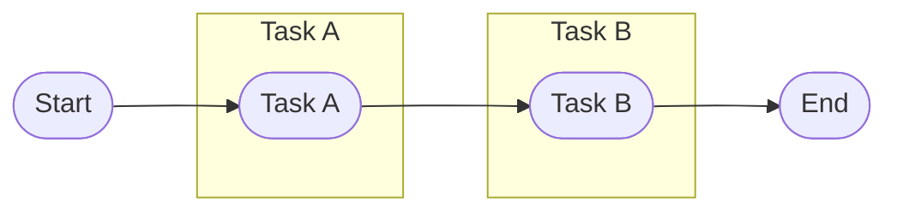

Async Rust
==========

Often times, when we write code, we have to wait on certain things happening. For example, if we want parse a json file
from a url, into a structure in our code: we have to download the file, putting it into memory, and then parse it into
meaningful data.

Let's say we need to download many files for our application to work. Waiting for each file to be fully downloaded and
parsed one after the other is going to take a long time, and for a lot of that time, we're just waiting, not doing
anything.

We could spin up threads to manage each file separately but there's a lot of mental overhead in that, and this may be
only one small task in a much larger program. Depending on where and how our program is running, threads may not even be
available.

Asynchronous programming is a way to structure our code so that we can do work when nothing else is happening, and it
doesn't depend on specific way to get the work done.

In this chapter we're going explain the modular design of async programming in Rust with the aim of getting a solid
understanding of the concepts involved, even though, in the real world, you're likely to depend on others to design and
build many of the parts of the system you'll depend on.

Breaking Down Work
------------------

Instead of waiting on one thing to be finished before we start the next thing, we could think of our code as a set of
tasks that need to be completed. Imagine we have two tasks, A and B, where B depends on work done by A.



But these tasks could be broken down into smaller parts, and it turns out that only the last bit of B requires A to be
complete.


Tasks, Schedulers, Futures, and Executors
-----------------------------------------

There are four concepts we need to understand to get a good grip on Async Rust: Tasks, Schedulers, Futures, and
Executors... but don't panic, we can break this down into two groups.

Tasks and Schedulers are conceptual ideas that represent what we want to do, whereas Futures, Executors are how Rust
achieves this in practice.

Tasks represent the work we want to do. The Scheduler decides which task should be run. Importantly, in Rust, while the
scheduler can start (and wake) tasks, it can't interrupt them. Tasks must hand execution back to the scheduler when they
can not proceed further. This is how async Rust can work entirely on a single thread, but it means you need to be
mindful when writing your code to avoid blocking. When a task can not proceed, but is not complete, it stops running and
waits to be woken to hopefully complete.

Rust abstracts the idea of tasks and schedulers with futures and executors. Most of the time you will not need to write
your own futures or executors, but we're diving in so that we can understand more about what's happening.

The executor is both the scheduler and the task runner. It will decide which task needs to run next and run that task
until the task defers execution back to the scheduler (regardless of whether the task is complete).

### Futures

The Future trait represents a task that may or may not be complete. 

```rust
# use std::pin::Pin;
# use std::task::{Context, Poll};
#
# fn main() {}
# 
pub trait Future {
    type Output;

    // Required method
    fn poll(self: Pin<&mut Self>, cx: &mut Context<'_>) -> Poll<Self::Output>;
}
```

The executor uses the poll method to progress the task the future represents. `Poll` is an enum. If the task is done,
it returns `Poll::Ready(Self::Output)`. If the task is passing back control to the executor, but is not yet complete, it
will return `Poll::Pending`. 

If `Poll::Pending` is returned, then the future will need to be run again... but when.

```rust
use std::pin::Pin;
use std::task::{Context, Poll, Waker};

struct ExampleFuture;

impl Future for ExampleFuture {
    type Output = &'static str;

    fn poll(self: Pin<&mut Self>, cx: &mut Context<'_>) -> Poll<Self::Output> {
        Poll::Ready("The future ran")
    }
}

fn main() {
    let mut example = ExampleFuture;

    let example = Pin::new(&mut example);
    let mut context = Context::from_waker(Waker::noop());

    // The work doesn't actually happen until we call `poll`
    let result = example.poll(&mut context);
    assert_eq!(result, Poll::Ready("The future ran"));
}
```

One quirk of Rust's Futures is that they _allow_ self-referential data, that is data that points to itself. Because of
this, we _must_ Pin data to prevent it moving. We won't dive too deep into how Pin works here, but suffice to say it's
enough for it to take ownership of a mutable reference to the data to prevent it moving.

We also need to pass a context to poll, which we'll cover later (for now we aren't using it).

If a task can't be completed, we need to call poll again. Each time we call poll we're asking the Future to continue
working as far as it can, after which it may be `Ready` or it may still be `Pending`.

```rust
use std::pin::Pin;
use std::task::{Context, Poll, Waker};

struct ExampleFuture {
    work_remaining: u8,
}

impl Future for ExampleFuture {
    type Output = &'static str;

    fn poll(self: Pin<&mut Self>, cx: &mut Context<'_>) -> Poll<Self::Output> {
        match self.work_remaining {
            0 => Poll::Ready("All done!"),
            _ => {
                self.get_mut().work_remaining -= 1;
                Poll::Pending
            }
        }
    }
}

fn main() {
    // We can also Pin a future by putting it in a Box
    let mut example = Box::pin(ExampleFuture { work_remaining: 3 });
    
    let mut context = Context::from_waker(Waker::noop());
    
    // The as_mut method will then give us a Pin of the Future
    assert_eq!(example.as_mut().poll(&mut context), Poll::Pending);
    
    // The pin is consumed by poll, so we need to repin each time
    assert_eq!(example.as_mut().poll(&mut context), Poll::Pending);
    assert_eq!(example.as_mut().poll(&mut context), Poll::Pending);
    assert_eq!(example.as_mut().poll(&mut context), Poll::Ready("All done!"));
}
```

So managing futures is just about repeatedly calling `.poll()` right? Well... no, not quite.

We could get a list of Futures and take turns calling `.poll()` on each of them, removing them from the list as they
complete... but this would be incredibly inefficient. Imagine we want to download a large file from a slow server, it
could take minutes to complete. If we constantly poll a Future waiting on that file, we'd be calling it potentially
millions of times with no progress being made.

For now, lets ignore that though, and start by writing an executor.


Instead, where possible, it's preferable to allow the Future to inform the Executor when it can make more progress using
a `Waker`. A `Waker` is just a function called to let the executor know that the Future it passed the Waker too, should
now be polled again. We tell the Future about the Waker via the Context that's passed into the Future each time it's 
polled.

### Waking 

```rust
// use std::thread::{sleep, spawn};
// use std::time::Duration;
// use std::pin::Pin;
// use std::task::{Context, Poll, Waker};
// 
// struct ExampleFuture {
//     work_remaining: u8,
// }
// 
// impl Future for ExampleFuture {
//     type Output = &'static str;
// 
//     fn poll(self: Pin<&mut Self>, cx: &mut Context<'_>) -> Poll<Self::Output> {
//         match self.work_remaining {
//             0 => Poll::Ready("All done!"),
//             _ => {
//                 self.get_mut().work_remaining -= 1;
//                 // Warning, this join handler gets orphaned.
//                 spawn(|| {
//                     sleep(Duration::from_secs(1));
//                     cx.waker().wake();
//                 });
//                 Poll::Pending
//             }
//         }
//     }
// }
// 
// fn main() {
//     let mut example = Box::pin(ExampleFuture { work_remaining: 3 });
// 
//     let mut context = Context::from_waker(Waker::noop());
// 
//     // This time the work isn't completed on the first call.
//     assert_eq!(example.as_mut().poll(&mut context), Poll::Pending);
// 
//     // The pin is consumed by poll, so we need to repin each time
//     assert_eq!(example.as_mut().poll(&mut context), Poll::Pending);
//     assert_eq!(example.as_mut().poll(&mut context), Poll::Pending);
//     assert_eq!(example.as_mut().poll(&mut context), Poll::Ready("All done!"));
// }

```

Async / Await
-------------

### Join!

Creating a Basic Runtime
------------------------

Over in the Real World
----------------------
