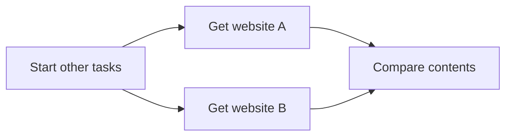

Async Rust
==========

Often times, when we write code, we have to wait on certain "things that take time" to happen. "Things that take time"
are usually things like IO, such as reading or writing to a disk, getting data from a database, downloading a file, etc. 
Sometimes "things that take time" could just be computationally expensive, such as processing large amounts of data.

Our programs are typically complex with multiple parts to them. For example, applications often have a user interface,
whether that's via a terminal, a web page, or a full desktop GUI. If our application has to wait on something happening,
we don't want other aspects (like the UI) to freeze up, unable to do anything while we wait.

Asynchronous programming is a way to structure our code so that we can continue to do work while waiting on other
things, and it doesn't depend on any specific way to get the work done. Under the hood, we might use threads, or we may
depend on Operating System hooks or even, for embedded programming, hardware interrupts, and exceptions.

In this chapter we're going to explain the modular design of async programming in Rust. Our aim is to get a solid(ish)
understanding of the concepts involved, even though, in the real world, you're likely to depend on others to design and
build the more complex parts of the system.

Move and Pin
------------

Before we go further into the chapter, we once again need to talk about memory, specifically: moving and pinning.

All data in our running program exists somewhere in memory, whether it's the stack, the heap, or static memory. That
means that everything has a pointer address in memory. 

When we pass a variable to another function, ownership of that variable "moves" to the other function. When we add a
variable to a `Vec` then ownership of that variable "moves" to the heap. Any time data "moves" ownership, it also
physically moves in memory. 

Run this and look closely at the returned addresses. They're similar, but they are different.

```rust
fn main() {
    let hello = "Hello".to_string();
    
    let hello_ptr = &raw const hello;
    println!("Hello is stored at {hello_ptr:p}");
    
    example_move(hello);
}

fn example_move(hello: String) {
    let hello_ptr = &raw const hello;
    println!("Hello is stored at {hello_ptr:p}");
}
```

Because `example_move()` takes ownership of the `String`, and as we learned in the [unsafe](./unsafe.md) chapter, the 
metadata for `String` is stored on the stack, meaning that _that_ portion of the data is copied to the memory for the 
new function (often called a stack frame). 

This is usually fine, but _occasionally_ things might need to know where they themselves are in memory. This is called
self-referencing. If something references itself, and we move it, where does that reference now point?

In the below example we create a self-referential struct and pass it to a function up the stack. When you run the code,
you'll see our last assertion fails.

```rust,should_panic
// --- Self Referencing Data Type

struct ExampleOfSelfReference {
    value: usize,
    reference_to_value: Option<*const usize>,
}

impl ExampleOfSelfReference {
    fn new(value: usize) -> Self {
        Self {
            value,
            reference_to_value: None,
        }
    }
    
    fn set_reference(&mut self) {
        self.reference_to_value = Some(&raw const self.value);
    }
    
    fn get_value(&self) -> usize {
        // SAFETY: This is intentionally NOT safe, don't try this at home!
        unsafe { *self.reference_to_value.expect("Did not set_reference") }
    }
}

// --- Usage ---

# fn main() {
let mut example = ExampleOfSelfReference::new(1);

// We need to set the reference now as the constructor moves the data too!
example.set_reference();

// Check the value was initialised correctly
assert_eq!(example.get_value(), 1);

// Update the value and check it was updated
example.value = 2;
assert_eq!(example.get_value(), 2);

// This causes a move in the same stack frame
let mut example = example;

// Update the value again and check it was updated
example.value = 3;
assert_eq!(example.get_value(), 3);
# }
```

`reference_to_value` is just a number pointing at a location in memory. We moved the data, but the pointer is still
pointing at the old location.

Self-referential data is dangerous... but it can also be useful in certain circumstances. For this reason, some Generic 
types occasionally need to take it into consideration. To keep ourselves safe, we can "pin" arbitrary data to memory,
preventing it from being moved. We use the `Pin` type to express this behavior, though the type itself is just a
container for a mutable reference, so the Pin itself is safe to move around. Through the magic of the borrow checker,
holding that single mutable reference is enough to lock the data in place.

```rust
use std::pin::Pin;

# struct ExampleOfSelfReference {
#     value: usize,
#     reference_to_value: Option<*const usize>,
# }
# 
# impl ExampleOfSelfReference {
#     fn new(value: usize) -> Self {
#         Self {
#             value,
#             reference_to_value: None,
#         }
#     }
# 
#     fn set_reference(&mut self) {
#         self.reference_to_value = Some(&raw const self.value);
#     }
# 
#     fn get_value(&self) -> usize {
#         // SAFETY: This is intentionally NOT safe, don't try this at home!
#         unsafe { *self.reference_to_value.expect("Did not set_reference") }
#     }
# }
# 
# fn main() {
let mut example = ExampleOfSelfReference::new(1);
example.set_reference();
    
// Pin doesn't take ownership of the data, it takes a mutable reference to it
let mut pinned_example = Pin::new(&mut example);

// We can still read the value thanks to Deref
assert_eq!(pinned_example.get_value(), 1);

// But we can no longer mutate or move the data
// example.value = 2;
// let example = example;

// We can, however, safely mutate `example` using DerefMut on the pin
pinned_example.value = 2;
assert_eq!(pinned_example.get_value(), 2);

// We can even move the pin, since it itself is just a reference
let mut pinned_example = pinned_example;
pinned_example.value = 3;
assert_eq!(pinned_example.get_value(), 3);
# }
```

There's a lot to `Pin` so and if you're curious about it, the [std documentation](https://doc.rust-lang.org/std/pin/)
has a lot more information. For this chapter its enough to know that, in specific circumstances, like in modular
asynchronous architecture where we don't necessarily control everything, we need to be certain data won't move
unexpectedly, and this is achieved through the `Pin` type.

> Note: There are other ways to pin data including `Box::pin(T)` and the `pin!` macro which have their utility but,
> crucially, do move the data you're trying to prevent moving, so watch out for that! 😅

Breaking Down Work
------------------

When we build software, we can compartmentalize different parts of our program into tasks. 

Imagine we want to download two websites and compare the contents. We download website A, then download website B, then
compare the contents of the two sites. If we break that down into tasks, it might look like this.


However, now that we've broken it down into tasks, we can see the tasks for getting the websites don't depend on each
other and could be performed at the same time.



Asynchronous design allows us to reason about our code at the task level. It doesn't specifically tell us how that work
will get done, though. In C# the default way async tasks are run is using multiple threads in a thread pool. Node.js is
a single threaded runtime, though, so async code uses operating system callbacks to let your program know when a task is
complete.

Rust provides ways to structure asynchronous code out of the box but doesn't have a default way of making sure
Asynchronous work is performed. This allows software engineers to choose the method that will work best for their
application.

In the following sections we'll go over the Rust way of thinking about asynchronous tasks and create our own way of
getting the work described by those asynchronous tasks to run.

Tasks, Schedulers, Futures, and Executors
-----------------------------------------

Asynchronous architectures allow us to break our work up so that we can process different bits of that work while
waiting on other bits. Conceptually, we break the work into tasks and then have some sort of scheduler that decides
which task gets run when.

In Rust, we represent tasks with the `Future` trait, which can be applied to any type. We manage task scheduling through
what are usually called executors (sometimes called runtimes), which themselves use `Waker`s to decide when to run
different tasks. 

This sounds complicated, but by the end of this chapter, you'll hopefully have a reasonable idea of how `Future`s,
executors, and `Waker`s work together, and if you don't... that's actually ok. Most of the time you won't need to write
any of these things yourself, but having even a vague understanding of them will help you write better async code, as
well as spot and fix common issues you might run across.

Let's get started by building up our understanding step by step.

### Futures

The `Future` trait represents a task that may or may not be complete (something that will be completed in the future, 
but not necessarily now).

```rust
# use std::pin::Pin;
# use std::task::{Context, Poll};
#
# fn main() {}
# 
pub trait Future {
    type Output;

    // Required method
    fn poll(self: Pin<&mut Self>, cx: &mut Context<'_>) -> Poll<Self::Output>;
}
```

It has an associated type, `Output` and a single method, `.poll()`.

`Output` represents the type of the data eventually returned by the `Future`. Usually this type will actually be a 
`Result<T, E>` because if we're waiting on something happening, there's a chance that it might not.

The `.poll()` method is a lot more interesting though. Firstly, you'll notice that `self` is typed, which we haven't
seen in this book before. In `Future`'s, `self` is a Pinned mutable reference to data of the type the `Future` is
applied to. The reason for this is _where_ the Future executes might change, but because you might want to apply a
`Future` to a self-referential type, we need to know the data the `Future` represents won't itself move.

`.poll()` also takes a mutable reference to some sort of `Context` type. For now, the only thing `Context` contains is
a `Waker` which we'll talk about later. The reason we don't pass the `Waker` directly though is that in the future we
might want to add more data to a `Context` (this can be done in `nightly` Rust but this is outside the scope of this
book).

Finally, the return type of `.poll()` method is a `Poll` enum. `.poll()` should be called any time we want to make
progress on a task. The return type tells us whether that call has resulted in an `Output`, represented by
`Poll::Ready(Self::Output)`, or if the poll is not currently complete and needs to be called again, represented by
`Poll::Pending`.

> Note: Once a Future has returned Ready, you _shouldn't_ call it again... we will be breaking this rule later but,
> we'll be very cautious when we do 😉.

Let's create a simple `ExampleFuture` and apply the `Future` trait to it: 

```rust
use std::pin::Pin;
use std::task::{Context, Poll, Waker};

// --- Implementing Future on Example Type ---

struct ExampleFuture;

impl Future for ExampleFuture {
    type Output = &'static str;

    fn poll(self: Pin<&mut Self>, _cx: &mut Context<'_>) -> Poll<Self::Output> {
        Poll::Ready("The future ran")
    }
}

// --- Usage ---

# fn main() {
// We'll enstantiate our future and pin it
let mut example = ExampleFuture;
let example = Pin::new(&mut example);

// Don't worry about context yet, it has no effect in this example
let mut context = Context::from_waker(Waker::noop());

// Nothing happens until we poll the future
let result = example.poll(&mut context);
# assert_eq!(result, Poll::Ready("The future ran"));

// The .poll() method returns a Poll enum we need to resolve 
match result {
    Poll::Ready(output) => println!("{output}"),
    Poll::Pending => panic!("This shouldn't happen!"),
}
# }
```

In this example we create `ExampleFuture` in the `example` variable, and then shadow the `example` variable with a `Pin`
that references the original `example` data. I think this is quite tidy as we no longer need access to the original 
data, arguably it's better not to have it, but it's still right where it was in the stack frame.

As previously mentioned, there are several ways to pin data depending on what you specifically want to do. In this case
we're pinning `example` to the stack, though this isn't always the best place to put it. For example, if you need to
return the data down the stack, it would be better to put it on the heap with `Box::pin`.

We then create a `Context` that contains a `Waker`. In this case we'll use a `Waker` that doesn't do anything, because
we aren't using the `Waker` for now. Normally you'll only use a `Waker::noop` for testing or examples, as it prevents
the Future from controlling its own execution (we'll get into how this works later).

When we call `.poll` on the Future, it instantly responds with a `Poll::Ready` containing a statically referenced string
slice.

Normally, `Future`s won't be "ready" immediately, and will need to be polled again. Let's create a `Future` that doesn't
complete the first time you poll it, using a simple counter.

```rust
use std::pin::{pin, Pin};
use std::task::{Context, Poll, Waker};

// --- Future ---

struct FakeWorker {
    work_remaining: u8,
}

impl Future for FakeWorker {
    type Output = &'static str;

    fn poll(self: Pin<&mut Self>, _cx: &mut Context<'_>) -> Poll<Self::Output> {
        match self.work_remaining {
            0 => Poll::Ready("All done!"),
            _ => {
                // .get_mut() turns `Pin<&mut T>` into `&mut T`, but consumes the pin.
#                 // Hello person revealing the hidden code! 👋🏻 Just a thought here...
#                 // why isn't `self` mutable? If it was we could use `as_mut`
#                 // without consuming the pin. If you need multiple mutations in a
#                 // `Future`, you need to unwrap the pin early.
#                 // 
#                 // Furthermore, .get_mut() only works on types that are `Unpin` meaning
#                 // it won't work on self-referential types that actually do need to be
#                 // pinned.
                self.get_mut().work_remaining -= 1;
                Poll::Pending
            }
        }
    }
}

// --- Usage ---

# fn main() {
let mut example = FakeWorker { work_remaining: 3 };
let mut example = Pin::new(&mut example);

let mut context = Context::from_waker(Waker::noop());

// Pins are consumed when the Future is called but as_mut will effectively
// duplicate the Pin... it's weird, but useful.
assert_eq!(example.as_mut().poll(&mut context), Poll::Pending);
assert_eq!(example.as_mut().poll(&mut context), Poll::Pending);
assert_eq!(example.as_mut().poll(&mut context), Poll::Pending);
assert_eq!(example.as_mut().poll(&mut context), Poll::Ready("All done!"));
# }
```

Each time we call `.poll()`, our `FakeWorker` pretends to do some work, after which it may be `Ready` or it may still 
be `Pending`.

So managing futures is just about repeatedly calling `.poll()` right? Well... no, not quite.

### Executors

Let's create a simple executor that _will_ just poll `Future`s until they're `Ready`. This executor takes a single
generic `Future` and loops over the poll method  

```rust,no_run
use std::task::{Context, Poll, Waker};
use std::pin::pin;

fn loop_executor<F: Future>(future: F) -> F::Output {
    let mut pinned_future = pin!(future);
    let mut context = Context::from_waker(Waker::noop());

    let mut loop_counter = 1;

    let result = loop {
        match pinned_future.as_mut().poll(&mut context) {
            Poll::Ready(r) => break r,
            Poll::Pending => loop_counter += 1,
        }
    };

    println!("All done!");
    println!("We called .poll() {loop_counter} times!");

    result
}
```

In this example our executor takes an arbitrary `Future`, pins it with the `pin!` macro.

`Pin::new()` only works for types that are `Unpin`, and we don't want to restrict our executor to `F: Future + Unpin`, 
so instead we'll use the `pin!` macro. However, one thing to watch out for is that this macro will itself cause whatever 
you put in it to move! It only prevents moves after that.

You'll notice the executor also returns `Future::Output`. We won't use that much to begin with, it'll be useful as we
move onto more advanced use cases.

We poll the future in a loop until it's Ready. For now, we'll keep count of how many times we called `.poll()` with
`loop_counter`. This is for demonstrative purposes, and we'll change and eventually remove this in later examples.

Passing our previous example in, this seems to work quite well:

```rust
# use std::task::{Context, Poll, Waker};
# use std::pin::{pin, Pin};
# 
# struct FakeWorker {
#     work_remaining: u8,
# }
# 
# impl Future for FakeWorker {
#     type Output = &'static str;
# 
#     fn poll(self: Pin<&mut Self>, cx: &mut Context<'_>) -> Poll<Self::Output> {
#         match self.work_remaining {
#             0 => Poll::Ready("All done!"),
#             _ => {
#                 self.get_mut().work_remaining -= 1;
#                 Poll::Pending
#             }
#         }
#     }
# }
# 
# fn loop_executor<F: Future>(future: F) -> F::Output {
#     let mut pinned_future = pin!(future);
#     let mut context = Context::from_waker(Waker::noop());
# 
#     let mut loop_counter = 1;
# 
#     let result = loop {
#         match pinned_future.as_mut().poll(&mut context) {
#             Poll::Ready(r) => break r,
#             Poll::Pending => loop_counter += 1,
#         }
#     };
# 
#     println!("All done!");
#     println!("We called .poll() {loop_counter} times!");
# 
#     result
# }
# 
# fn main() {
let future = FakeWorker { work_remaining: 3 };
let _ = loop_executor(future);
# }
```

`.poll()` is called exactly the number of times it takes to get all the work in `FakeWorker` done. 

But `Future`s usually wait on things like IO or heavy compute tasks which won't nicely finish after a set number of 
calls. Let's try mimicking that with a simple timer:

```rust
# use std::task::{Context, Poll, Waker};
# use std::pin::{pin, Pin};
use std::time::{SystemTime, Duration};
use std::ops::Add;

// --- Example of a future that is time-based --- 

struct Timer {
    time_to_end: SystemTime,
}

impl Timer {
    fn new(duration: Duration) -> Timer {
        Self {
            time_to_end: SystemTime::now().add(duration),
        }
    }
}

impl Future for Timer {
    type Output = ();

    fn poll(self: Pin<&mut Self>, _cx: &mut Context<'_>) -> Poll<Self::Output> {
        if self.time_to_end <= SystemTime::now() {
            Poll::Ready(())
        } else {
            Poll::Pending
        }
    }
}

# fn loop_executor<F: Future>(future: F) -> F::Output {
#     let mut pinned_future = pin!(future);
#     let mut context = Context::from_waker(Waker::noop());
#    
#     let mut loop_counter = 1;
#    
#     let result = loop {
#         match pinned_future.as_mut().poll(&mut context) {
#             Poll::Ready(r) => break r,
#             Poll::Pending => loop_counter += 1,
#         }
#     };
#
#     println!("All done!");
#     println!("But this time we called .poll() {loop_counter} times, yikes!");
#
#     result
# }
# 
// --- Usage ---

# fn main() {
let future = Timer::new(Duration::from_secs(1));
let _ = loop_executor(future);
# }
```

When you run this code here, it's sent to Rust Playground and executed in a sandbox in debug mode, so `.poll()` is
likely called hundreds of thousands of times. In release mode on a good computer, it might call `.poll()` hundreds of 
millions of times. Each time we call `.poll()` we're making a system call to get the time, then doing a comparison with
the stored time. We're doing that millions of times... what a massive waste of compute power.

If only there was a way for the `Future` to let us know when it was ready to be polled again.

### Waking 

A `Waker` is a struct the `Future` can use to inform the executor it's ready to have its `.poll()` method called again.

Before we get to that, though, we're going to update our program to use threads for both tasks and scheduling. It's
important to note, however, that threads are not a necessary element of asynchronous Rust, there are other ways to 
achieve Waking, but for now, this is the approach we'll take.

```rust
use std::task::{Context, Poll, Waker};
use std::pin::{pin, Pin};
use std::time::Duration;
use std::thread::{sleep, spawn, JoinHandle};
use std::sync::{Arc, Mutex};

// --- New Timer using threads ---

pub struct ThreadTimer {
    duration: Duration,
    join_handle: Option<JoinHandle<()>>,
    waker: Arc<Mutex<Waker>>,
    is_complete: Arc<Mutex<bool>>
}

impl ThreadTimer {
    pub fn new(duration: Duration) -> ThreadTimer {
        Self {
            duration,
            join_handle: None,
            is_complete: Arc::new(Mutex::new(false)),
            waker: Arc::new(Mutex::new(Waker::noop().clone())),
        }
    }
}

impl Future for ThreadTimer {
    type Output = ();

    fn poll(self: Pin<&mut Self>, cx: &mut Context<'_>) -> Poll<Self::Output> {
        let fut = self.get_mut();
        
        // We always need to update the waker whenever we're polled
        *fut.waker.lock().expect("Thread crashed with mutex lock") = cx.waker().clone();
        
        // If we haven't started the thread, do so now
        if fut.join_handle.is_none() {
            let duration = fut.duration;
            let waker = fut.waker.clone();
            let is_complete = fut.is_complete.clone();
            fut.join_handle = Some(spawn(move || {
                sleep(duration);
                *is_complete.lock().expect("Thread crashed with mutex lock") = true;
                waker
                    .lock()
                    .expect("Thread crashed with mutex lock")
                    .wake_by_ref();
            }));
        }
        
        match *fut.is_complete.lock().expect("Thread crashed with mutex lock") {
            true => Poll::Ready(()),
            false => Poll::Pending,
        }
    }
}

# fn loop_executor<F: Future>(future: F) -> F::Output {
#     let mut pinned_future = pin!(future);
#     let mut context = Context::from_waker(Waker::noop());
#    
#     let mut loop_counter = 1;
#    
#     let result = loop {
#         match pinned_future.as_mut().poll(&mut context) {
#             Poll::Ready(r) => break r,
#             Poll::Pending => loop_counter += 1,
#         }
#     };
#
#     println!("All done!");
#     println!("But we called .poll() {loop_counter} times, yikes!");
#
#     result
# }
# 
// --- Usage ---

# fn main() {
let future = ThreadTimer::new(Duration::from_secs(1));
let _ = loop_executor(future);
# }
```

Our timer now has a `Duration`, an optional `JoinHandle`, a `is_complete` boolean wrapped in an `Arc<Mutex<_>>` and 
`Waker` also wrapped in an `Arc<Mutex<_>>`. When we create a new instance of it, we store the Duration, set the 
`JoinHandle` to `None`, `is_complete` to `false`, and storing a No-Op waker in the waker field.

When `.poll()` is called, we replace the `Waker` with the one given to us by the executor. We do this _every_ time 
`.poll()` is called because it could be that the responsibility for keeping track of our future might move and a 
different executor needs to be woken when the future is ready to do more work.

Next we look to see if the thread has been started.

If we don't currently have a join handle, then we start a new thread, passing in the duration and our Arc'd Waker and
`is_complete`. Using the `Arc<Mutex<_>>` allows us to make these values accessible from both threads. The thread we're
starting sleeps itself for the duration, updates `is_complete`, and finally calls the `Waker` by calling using the
`.wake_by_ref()` method which avoids consuming the `Waker` which is owned by the Future.

> Note: Thread sleeps are not accurate, the only thing that can be guaranteed is that the thread will sleep for 
> _at least_ the given Duration... unless the Duration is zero, in which case even sleeping isn't guaranteed. It's fine
> for this demonstration, though.

If the thread has been started, check the value of `is_complete` for which variant of Poll should be returned.

We're still using the old executor, so if you run this, you'll see we poll hundreds of thousands of times. 

Let's fix that next. First, we need a `Waker`. The `Waker` type itself is a concrete type, but when its created we can
give it any type that implements the `Wake` trait.

```rust,no_run
use std::thread::{self, Thread};
use std::task::Wake;
use std::sync::Arc;

pub struct ThreadWaker {
    thread: Thread,
}

impl ThreadWaker {
    pub fn current_thread() -> Self {
        ThreadWaker {
            thread: thread::current(),
        }
    }
}

impl Wake for ThreadWaker {
    fn wake(self: Arc<Self>) {
        self.thread.unpark();
    }
}
```

Our `ThreadWaker` is fairly straightforward. We can create it with the `current_thread()` static method in which it
takes a note of whatever thread it was created on. We implement the `Wake` trait for it, and when we call `wake`, all we
do is "unpark" that thread.

Parking and Unparking is akin to pausing and unpausing threads. In Rust, a thread can only park itself, and only a
different thread can unpark it.

We use this to create an executor that parks the thread it's on while waiting for `Future`s to request being polled by
calling the `Waker` that will unpark the executor's thread.

```rust
# use std::task::{Context, Poll, Waker, Wake};
# use std::pin::{pin, Pin};
# use std::time::Duration;
# use std::thread::{self, Thread, sleep, spawn, JoinHandle};
# use std::sync::{Arc, Mutex};
# 
# pub struct ThreadWaker {
#     thread: Thread,
# }
# 
# impl ThreadWaker {
#     pub fn current_thread() -> Self {
#         ThreadWaker {
#             thread: thread::current(),
#         }
#     }
# }
# 
# impl Wake for ThreadWaker {
#     fn wake(self: Arc<Self>) {
#         self.thread.unpark();
#     }
# }
#
# pub struct ThreadTimer {
#     duration: Duration,
#     join_handle: Option<JoinHandle<()>>,
#     waker: Arc<Mutex<Waker>>,
#     is_complete: Arc<Mutex<bool>>
# }
# 
# impl ThreadTimer {
#     pub fn new(duration: Duration) -> ThreadTimer {
#         Self {
#             duration,
#             join_handle: None,
#             is_complete: Arc::new(Mutex::new(false)),
#             waker: Arc::new(Mutex::new(Waker::noop().clone())),
#         }
#     }
# }
# 
# impl Future for ThreadTimer {
#     type Output = ();
# 
#     fn poll(self: Pin<&mut Self>, cx: &mut Context<'_>) -> Poll<Self::Output> {
#         let fut = self.get_mut();
# 
#         // We always need to update the waker whenever we're polled
#         *fut.waker.lock().expect("Thread crashed with mutex lock") = cx.waker().clone();
# 
#         // If we haven't started the thread, do so now
#         if fut.join_handle.is_none() {
#             let duration = fut.duration;
#             let waker = fut.waker.clone();
#             let is_complete = fut.is_complete.clone();
#             fut.join_handle = Some(spawn(move || {
#                 sleep(duration);
#                 *is_complete.lock().expect("Thread crashed with mutex lock") = true;
#                 waker
#                     .lock()
#                     .expect("Thread crashed with mutex lock")
#                     .wake_by_ref();
#             }));
#         }
# 
#         match *fut.is_complete.lock().expect("Thread crashed with mutex lock") {
#             true => Poll::Ready(()),
#             false => Poll::Pending,
#         }
#     }
# }
#
// --- Executor ---

fn block_thread_on<F: Future>(future: F) -> F::Output {
    let mut example = pin!(future);

    // This is how we turn ThreadWaker into Waker
    let waker = Arc::new(ThreadWaker::current_thread()).into();
    let mut context = Context::from_waker(&waker);
    
    let mut loop_counter = 1;
    let output = loop {
        match example.as_mut().poll(&mut context) {
            Poll::Ready(output) => break output,
            Poll::Pending => {
                loop_counter += 1;
                std::thread::park();
            },
        }
    };
# 
#     assert_eq!(loop_counter, 2);
    
    println!("All done!");
    println!("This time .poll() was only called {loop_counter} times, yay!");
    
    output
}

// --- Usage ---

# fn main() {
let future = ThreadTimer::new(Duration::from_secs(1));
let _ = block_thread_on(future);
# }
```

Our new executor has the same signature as the old one, but this time it creates a `Waker` based on our `ThreadWaker`.
Because the `ThreadWaker` is created on the same thread that the executor runs on, it keeps a note of that thread before
being passed to our `Future`. After polling the `Future`, if the `Future` isn't ready, then the executor parks its own 
thread and waits for the `Waker` to unpark it.

When you run this, you can see that our code is much more efficient with our poll method only being called twice, once
to start progressing the future, and once more to complete the future after the `Waker` is called.

This means the program spends most of its one(ish) second runtime asleep, leaving resources like the CPU free to use.

Async / Await
-------------

The whole point of asynchronous code architectures is that we break our code down into small tasks. Implementing our
own Futures is great for the very edge of our Rust code where we're waiting on some sort of I/O from outside our
program, or something like a compute heavy task we control.

Most of the time we won't necessarily even be doing that, though, as there are lots of crates for dealing with common
I/O tasks, like reading files, accessing databases, or downloading files. Most of the time, we just need to glue those
bits together.

This is where async/await comes in. We can make any block of code or any function a Future with the async keyword. Let's
try that out with our existing `block_thread_on` executor:

```rust
# use std::task::{Context, Poll, Waker, Wake};
# use std::pin::{pin, Pin};
# use std::time::Duration;
# use std::thread::{self, Thread, sleep, spawn, JoinHandle};
# use std::sync::{Arc, Mutex};
# 
# pub struct ThreadWaker {
#     thread: Thread,
# }
# 
# impl ThreadWaker {
#     pub fn current_thread() -> Self {
#         ThreadWaker {
#             thread: thread::current(),
#         }
#     }
# }
# 
# impl Wake for ThreadWaker {
#     fn wake(self: Arc<Self>) {
#         self.thread.unpark();
#     }
# }
# 
# fn block_thread_on<F: Future>(future: F) -> F::Output {
#     let mut example = pin!(future);
# 
#     let waker = Arc::new(ThreadWaker::current_thread()).into();
#     let mut context = Context::from_waker(&waker);
#
#     loop {
#         match example.as_mut().poll(&mut context) {
#             Poll::Ready(output) => break output,
#             Poll::Pending => std::thread::park(),
#         }
#     }
# }
#
async fn calling_this_function_returns_a_future() -> String {
    String::from("Inside an async function")
}

fn main() {
    let this_block_is_a_future = async {
        String::from("Inside an async block")
    };
    println!("{}", block_thread_on(this_block_is_a_future));
    println!("{}", block_thread_on(calling_this_function_returns_a_future()));
}
```

But async code does something a little bit special. It can work up to another future and then pause until that future
is ready to continue by using the `.await` postfix on a `Future`. What's rather brilliant in async code, though, is that
when woken, the code resumes from where it got to. Furthermore, `.await` will automatically unwrap the `Poll` enum for 
you, giving you the `Poll::Ready` value.

Let's use `async` to create one future that returns a value after a time, and a second that awaits that future, receives
the value, and does something with it:

```rust
# use std::task::{Context, Poll, Waker, Wake};
# use std::pin::{pin, Pin};
# use std::time::Duration;
# use std::thread::{self, Thread, sleep, spawn, JoinHandle};
# use std::sync::{Arc, Mutex};
# 
# pub struct ThreadWaker {
#     thread: Thread,
# }
# 
# impl ThreadWaker {
#     pub fn current_thread() -> Self {
#         ThreadWaker {
#             thread: thread::current(),
#         }
#     }
# }
# 
# impl Wake for ThreadWaker {
#     fn wake(self: Arc<Self>) {
#         self.thread.unpark();
#     }
# }
# 
# pub struct ThreadTimer {
#     duration: Duration,
#     join_handle: Option<JoinHandle<()>>,
#     waker: Arc<Mutex<Waker>>,
#     is_complete: Arc<Mutex<bool>>
# }
# 
# impl ThreadTimer {
#     pub fn new(duration: Duration) -> ThreadTimer {
#         Self {
#             duration,
#             join_handle: None,
#             is_complete: Arc::new(Mutex::new(false)),
#             waker: Arc::new(Mutex::new(Waker::noop().clone())),
#         }
#     }
# }
# 
# impl Future for ThreadTimer {
#     type Output = ();
# 
#     fn poll(self: Pin<&mut Self>, cx: &mut Context<'_>) -> Poll<Self::Output> {
#         let fut = self.get_mut();
# 
#         // We always need to update the waker whenever we're polled
#         *fut.waker.lock().expect("Thread crashed with mutex lock") = cx.waker().clone();
# 
#         // If we haven't started the thread, do so now
#         if fut.join_handle.is_none() {
#             let duration = fut.duration;
#             let waker = fut.waker.clone();
#             let is_complete = fut.is_complete.clone();
#             fut.join_handle = Some(spawn(move || {
#                 sleep(duration);
#                 *is_complete.lock().expect("Thread crashed with mutex lock") = true;
#                 waker
#                     .lock()
#                     .expect("Thread crashed with mutex lock")
#                     .wake_by_ref();
#             }));
#         }
# 
#         match *fut.is_complete.lock().expect("Thread crashed with mutex lock") {
#             true => Poll::Ready(()),
#             false => Poll::Pending,
#         }
#     }
# }
# 
# fn block_thread_on<F: Future>(future: F) -> F::Output {
#     let mut example = pin!(future);
# 
#     let waker = Arc::new(ThreadWaker::current_thread()).into();
#     let mut context = Context::from_waker(&waker);
#     
#     let mut loop_counter = 1;
#     loop {
#         match example.as_mut().poll(&mut context) {
#             Poll::Ready(output) => break output,
#             Poll::Pending => {
#                 loop_counter += 1;
#                 std::thread::park();
#             },
#         }
#     }
# }
# 
# fn main() {
// This async block is Future<Output = &'static str>
let future_with_value = async {
    ThreadTimer::new(Duration::from_secs(1)).await;
    "This future returns a static string reference"
};
    
// This async block is Future<Output = ()>
let future_that_uses_the_value_from_the_other_future = async { 
    let value = future_with_value.await;
    println!("Received: {value}");
};

// Running the second future so we can see the output
block_thread_on(future_that_uses_the_value_from_the_other_future);
# }
```

More importantly, because the value is considered to be instantly available after awaiting it, and because most of the
time when waiting on something we have to assume that thing might fail... we arrive at the most sublime pairing of Rust
syntax, `.await?`.

Functions that can fail should return a `Result`. `Future`'s always return `Poll` but `Future::Output` will _regularly_
be a Result.

```rust
# use std::task::{Context, Poll, Waker, Wake};
# use std::pin::{pin, Pin};
# use std::time::{Duration, SystemTime, UNIX_EPOCH};
# use std::thread::{self, Thread, sleep, spawn, JoinHandle};
# use std::sync::{Arc, Mutex};
# 
# struct ThreadWaker {
#     thread: Thread,
# }
# 
# impl ThreadWaker {
#     fn current_thread() -> Self {
#         ThreadWaker {
#             thread: thread::current(),
#         }
#     }
# }
# 
# impl Wake for ThreadWaker {
#     fn wake(self: Arc<Self>) {
#         self.thread.unpark();
#     }
# }
# 
# struct ThreadTimer {
#     duration: Duration,
#     join_handle: Option<JoinHandle<()>>,
#     waker: Arc<Mutex<Waker>>,
#     is_complete: Arc<Mutex<bool>>
# }
# 
# impl ThreadTimer {
#     fn new(duration: Duration) -> ThreadTimer {
#         Self {
#             duration,
#             join_handle: None,
#             is_complete: Arc::new(Mutex::new(false)),
#             waker: Arc::new(Mutex::new(Waker::noop().clone())),
#         }
#     }
# }
# 
# impl Future for ThreadTimer {
#     type Output = ();
# 
#     fn poll(self: Pin<&mut Self>, cx: &mut Context<'_>) -> Poll<Self::Output> {
#         let fut = self.get_mut();
# 
#         // We always need to update the waker whenever we're polled
#         *fut.waker.lock().expect("Thread crashed with mutex lock") = cx.waker().clone();
# 
#         // If we haven't started the thread, do so now
#         if fut.join_handle.is_none() {
#             let duration = fut.duration;
#             let waker = fut.waker.clone();
#             let is_complete = fut.is_complete.clone();
#             fut.join_handle = Some(spawn(move || {
#                 sleep(duration);
#                 *is_complete.lock().expect("Thread crashed with mutex lock") = true;
#                 waker
#                     .lock()
#                     .expect("Thread crashed with mutex lock")
#                     .wake_by_ref();
#             }));
#         }
# 
#         match *fut.is_complete.lock().expect("Thread crashed with mutex lock") {
#             true => Poll::Ready(()),
#             false => Poll::Pending,
#         }
#     }
# }
# 
# fn block_thread_on<F: Future>(future: F) -> F::Output {
#     let mut example = pin!(future);
# 
#     let waker = Arc::new(ThreadWaker::current_thread()).into();
#     let mut context = Context::from_waker(&waker);
#     
#     let mut loop_counter = 1;
#     loop {
#         match example.as_mut().poll(&mut context) {
#             Poll::Ready(output) => break output,
#             Poll::Pending => {
#                 loop_counter += 1;
#                 std::thread::park();
#             },
#         }
#     }
# }
# 
async fn this_future_could_fail() -> Result<u64, String> {
    let time = SystemTime::now()
        .duration_since(UNIX_EPOCH)
        .map_err(|_| "Time went backwards... a lot!".to_string())?
        .as_secs();
    // Check if the seconds are a multiple of 2 and convert to Result
    time.is_multiple_of(2)
        .then_some(time)
        .ok_or_else(|| "A completely unforeseen thing happened!".to_string())
    
}

async fn use_fallible_future() -> Result<(), String> {
    let time = this_future_could_fail().await?; // <- gorgeous!
    println!("{time} secs have passed since the Unix Epoch");
    Ok(())
}

# fn main() {
match  block_thread_on(use_fallible_future()) {
    Ok(()) => {},
#     // Fun fact, this ought to be eprintln! but Rust Playground / mdbook won't show it!
    Err(message) => println!("Error: {message}"),
}
# }
```

In fact, because `.await` is automatically unwrapping the `Poll`, and `?` is automatically unwrapping the `Result`, you
can further chain to the inner types. Imagine getting a `Poll<Result<Vec<T>, E>>` back from a `Future`, you could 
`.await?.into_iter().map(|t: T| /* do some work */)...` etc.

This is another one of those Rust features that makes the language really sublime to use!

Anyway, because the `.await` postfix works on any future, and async code will resume from where it left off, we can
`.await` several futures one after the other


```rust
# use std::task::{Context, Poll, Waker, Wake};
# use std::pin::{pin, Pin};
# use std::time::{Duration, Instant};
# use std::thread::{self, Thread, sleep, spawn, JoinHandle};
# use std::sync::{Arc, Mutex};
# 
# struct ThreadWaker {
#     thread: Thread,
# }
# 
# impl ThreadWaker {
#     fn current_thread() -> Self {
#         ThreadWaker {
#             thread: thread::current(),
#         }
#     }
# }
# 
# impl Wake for ThreadWaker {
#     fn wake(self: Arc<Self>) {
#         self.thread.unpark();
#     }
# }
# 
# struct ThreadTimer {
#     duration: Duration,
#     join_handle: Option<JoinHandle<()>>,
#     waker: Arc<Mutex<Waker>>,
#     is_complete: Arc<Mutex<bool>>
# }
# 
# impl ThreadTimer {
#     fn new(duration: Duration) -> ThreadTimer {
#         Self {
#             duration,
#             join_handle: None,
#             is_complete: Arc::new(Mutex::new(false)),
#             waker: Arc::new(Mutex::new(Waker::noop().clone())),
#         }
#     }
# }
# 
# impl Future for ThreadTimer {
#     type Output = ();
# 
#     fn poll(self: Pin<&mut Self>, cx: &mut Context<'_>) -> Poll<Self::Output> {
#         let fut = self.get_mut();
# 
#         // We always need to update the waker whenever we're polled
#         *fut.waker.lock().expect("Thread crashed with mutex lock") = cx.waker().clone();
# 
#         // If we haven't started the thread, do so now
#         if fut.join_handle.is_none() {
#             let duration = fut.duration;
#             let waker = fut.waker.clone();
#             let is_complete = fut.is_complete.clone();
#             fut.join_handle = Some(spawn(move || {
#                 sleep(duration);
#                 *is_complete.lock().expect("Thread crashed with mutex lock") = true;
#                 waker
#                     .lock()
#                     .expect("Thread crashed with mutex lock")
#                     .wake_by_ref();
#             }));
#         }
# 
#         match *fut.is_complete.lock().expect("Thread crashed with mutex lock") {
#             true => Poll::Ready(()),
#             false => Poll::Pending,
#         }
#     }
# }
# 
# fn block_thread_on<F: Future>(future: F) -> F::Output {
#     let mut example = pin!(future);
# 
#     let waker = Arc::new(ThreadWaker::current_thread()).into();
#     let mut context = Context::from_waker(&waker);
#     
#     let mut loop_counter = 1;
#     loop {
#         match example.as_mut().poll(&mut context) {
#             Poll::Ready(output) => break output,
#             Poll::Pending => {
#                 loop_counter += 1;
#                 std::thread::park();
#             },
#         }
#     }
# }
# 
# fn main() {
let future = async {
    println!("Starting future"); // Only prints once
    ThreadTimer::new(Duration::from_secs(2)).await;
    ThreadTimer::new(Duration::from_secs(1)).await;
    println!("Ending future"); // Only prints once
};

block_thread_on(future);
# }
```

`.await` essentially pauses the execution of the code until the ThreadTimer future is ready, then continues on from that
point. So this code is amazing, right? ... Right?

No! This code is bad, actually, but the reason may not be immediately obvious.

This version might help you see why the code is bad:

```rust
# use std::task::{Context, Poll, Waker, Wake};
# use std::pin::{pin, Pin};
# use std::time::{Duration, Instant};
# use std::thread::{self, Thread, sleep, spawn, JoinHandle};
# use std::sync::{Arc, Mutex};
# 
# struct ThreadWaker {
#     thread: Thread,
# }
# 
# impl ThreadWaker {
#     fn current_thread() -> Self {
#         ThreadWaker {
#             thread: thread::current(),
#         }
#     }
# }
# 
# impl Wake for ThreadWaker {
#     fn wake(self: Arc<Self>) {
#         self.thread.unpark();
#     }
# }
# 
# struct ThreadTimer {
#     duration: Duration,
#     join_handle: Option<JoinHandle<()>>,
#     waker: Arc<Mutex<Waker>>,
#     is_complete: Arc<Mutex<bool>>
# }
# 
# impl ThreadTimer {
#     fn new(duration: Duration) -> ThreadTimer {
#         Self {
#             duration,
#             join_handle: None,
#             is_complete: Arc::new(Mutex::new(false)),
#             waker: Arc::new(Mutex::new(Waker::noop().clone())),
#         }
#     }
# }
# 
# impl Future for ThreadTimer {
#     type Output = ();
# 
#     fn poll(self: Pin<&mut Self>, cx: &mut Context<'_>) -> Poll<Self::Output> {
#         let fut = self.get_mut();
# 
#         // We always need to update the waker whenever we're polled
#         *fut.waker.lock().expect("Thread crashed with mutex lock") = cx.waker().clone();
# 
#         // If we haven't started the thread, do so now
#         if fut.join_handle.is_none() {
#             let duration = fut.duration;
#             let waker = fut.waker.clone();
#             let is_complete = fut.is_complete.clone();
#             fut.join_handle = Some(spawn(move || {
#                 sleep(duration);
#                 *is_complete.lock().expect("Thread crashed with mutex lock") = true;
#                 waker
#                     .lock()
#                     .expect("Thread crashed with mutex lock")
#                     .wake_by_ref();
#             }));
#         }
# 
#         match *fut.is_complete.lock().expect("Thread crashed with mutex lock") {
#             true => Poll::Ready(()),
#             false => Poll::Pending,
#         }
#     }
# }
# 
# fn block_thread_on<F: Future>(future: F) -> F::Output {
#     let mut example = pin!(future);
# 
#     let waker = Arc::new(ThreadWaker::current_thread()).into();
#     let mut context = Context::from_waker(&waker);
#     
#     let mut loop_counter = 1;
#     loop {
#         match example.as_mut().poll(&mut context) {
#             Poll::Ready(output) => break output,
#             Poll::Pending => {
#                 loop_counter += 1;
#                 std::thread::park();
#             },
#         }
#     }
# }
# 
# fn main() {
let future = async {
    let now = Instant::now();
    ThreadTimer::new(Duration::from_secs(2)).await;
    ThreadTimer::new(Duration::from_secs(1)).await;
    now.elapsed().as_secs()
};

let time_taken = block_thread_on(future);
println!("Time taken {time_taken} seconds");
# assert_eq!(time_taken, 3);
# }
```

The total time taken to run the timers is 3 seconds, which makes sense right? We have a two-second timer and a 
one-second timer, combined, that's three seconds... but that's the problem...

### Join

The two timers in the previous examples are completely independent of each other. We should **not** be waiting for the
first timer to complete before working on the second timer, that defeats the benefits of asynchronous programming.

What would be more useful is if we do both bits of "work" at the same time. What we need to happen is for both Futures
to be polled at the same time. This is often called "joining".

We can (although we shouldn't, we'll come on to that in a bit) create a Join Future something like this. 

> I've hidden code concerning the MemoFuture as it's less relevant, but you can see it with the eye button.

```rust
# use std::cell::RefCell;
# use std::task::{Context, Poll, Waker, Wake};
# use std::pin::{pin, Pin};
# use std::time::{Duration, Instant};
# use std::ops::DerefMut;
# use std::thread::{self, Thread, sleep, spawn, JoinHandle};
# use std::sync::{Arc, Mutex};
# 
# struct ThreadWaker {
#     thread: Thread,
# }
# 
# impl ThreadWaker {
#     fn current_thread() -> Self {
#         ThreadWaker {
#             thread: thread::current(),
#         }
#     }
# }
# 
# impl Wake for ThreadWaker {
#     fn wake(self: Arc<Self>) {
#         self.thread.unpark();
#     }
# }
# 
# struct ThreadTimer {
#     duration: Duration,
#     join_handle: Option<JoinHandle<()>>,
#     waker: Arc<Mutex<Waker>>,
#     is_complete: Arc<Mutex<bool>>
# }
# 
# impl ThreadTimer {
#     fn new(duration: Duration) -> ThreadTimer {
#         Self {
#             duration,
#             join_handle: None,
#             is_complete: Arc::new(Mutex::new(false)),
#             waker: Arc::new(Mutex::new(Waker::noop().clone())),
#         }
#     }
# }
# 
# impl Future for ThreadTimer {
#     type Output = ();
# 
#     fn poll(self: Pin<&mut Self>, cx: &mut Context<'_>) -> Poll<Self::Output> {
#         let fut = self.get_mut();
# 
#         // We always need to update the waker whenever we're polled
#         *fut.waker.lock().expect("Thread crashed with mutex lock") = cx.waker().clone();
# 
#         // If we haven't started the thread, do so now
#         if fut.join_handle.is_none() {
#             let duration = fut.duration;
#             let waker = fut.waker.clone();
#             let is_complete = fut.is_complete.clone();
#             fut.join_handle = Some(spawn(move || {
#                 sleep(duration);
#                 *is_complete.lock().expect("Thread crashed with mutex lock") = true;
#                 waker
#                     .lock()
#                     .expect("Thread crashed with mutex lock")
#                     .wake_by_ref();
#             }));
#         }
# 
#         match *fut.is_complete.lock().expect("Thread crashed with mutex lock") {
#             true => Poll::Ready(()),
#             false => Poll::Pending,
#         }
#     }
# }
# 
# fn block_thread_on<F: Future>(future: F) -> F::Output {
#     let mut example = pin!(future);
# 
#     let waker = Arc::new(ThreadWaker::current_thread()).into();
#     let mut context = Context::from_waker(&waker);
#     
#     let mut loop_counter = 1;
#     loop {
#         match example.as_mut().poll(&mut context) {
#             Poll::Ready(output) => break output,
#             Poll::Pending => {
#                 loop_counter += 1;
#                 std::thread::park();
#             },
#         }
#     }
# }
# 
# enum InnerMemoFuture<F: Future> {
#     Pending(F),
#     Ready(F::Output),
#     Spent,
# }
# 
# impl<F: Future> InnerMemoFuture<F> {
#     fn new(future: F) -> Self {
#         Self::Pending(future)
#     }
# 
#     fn extract(self) -> Option<F::Output> {
#         match self {
#             InnerMemoFuture::Pending(_) => None,
#             InnerMemoFuture::Ready(output) => Some(output),
#             InnerMemoFuture::Spent => panic!("Attempted to extract a spent future"),
#         }
#     }
# }
# 
# #[derive(Debug)]
# struct InnerFutureSpentError;
#
# impl std::error::Error for InnerFutureSpentError {}
#
# impl std::fmt::Display for InnerFutureSpentError {
#     fn fmt(&self, f: &mut std::fmt::Formatter<'_>) -> std::fmt::Result {
#         write!(f, "Tried to extract output from spent future")
#     }
# }
# 
# struct MemoFuture<F: Future>(RefCell<InnerMemoFuture<F>>);
# 
# impl<F: Future> MemoFuture<F> {
#     fn new(future: F) -> Self {
#         Self(RefCell::new(InnerMemoFuture::new(future)))
#     }
# 
#     /// Warning: This will drop the future if the future is not Ready
#     fn extract(&self) -> Option<F::Output> {
#         let old_value = self.0.replace(InnerMemoFuture::Spent);
#         old_value.extract()
#     }
# }
# 
# impl<F: Future> Future for MemoFuture<F> {
#     type Output = Result<(), InnerFutureSpentError>;
# 
#     fn poll(self: Pin<&mut Self>, cx: &mut Context<'_>) -> Poll<Self::Output> {
#         let mut mutable_self = self.0.borrow_mut();
#         let inner_future = mutable_self.deref_mut();
# 
#         match inner_future {
#             InnerMemoFuture::Pending(future) => {
#                 // SAFETY: We own the future and are not moving it
#                 let pinned_future = unsafe { Pin::new_unchecked(future) };
#                 match pinned_future.poll(cx) {
#                     Poll::Ready(output) => {
#                         drop(mutable_self);
#                         self.0.replace(InnerMemoFuture::Ready(output));
#                         Poll::Ready(Ok(()))
#                     }
#                     Poll::Pending => Poll::Pending,
#                 }
#             }
#             InnerMemoFuture::Ready(_) => Poll::Ready(Ok(())),
#             InnerMemoFuture::Spent => Poll::Ready(Err(InnerFutureSpentError)),
#         }
#     }
# }
# 
// --- Join ---

struct Join<F1: Future, F2: Future>(
    Pin<Box<MemoFuture<F1>>>,
    Pin<Box<MemoFuture<F2>>>,
);

impl<F1: Future, F2: Future> Join<F1, F2> {
    fn new(future1: F1, future2: F2) -> Self {
        Self(
            Box::pin(MemoFuture::new(future1)),
            Box::pin(MemoFuture::new(future2)),
        )
    }
}

impl<F1: Future, F2: Future> Future for Join<F1, F2> {
    type Output = Result<(F1::Output, F2::Output), InnerFutureSpentError>;

    fn poll(self: Pin<&mut Self>, cx: &mut Context<'_>) -> Poll<Self::Output> {
        let inner = self.get_mut();

        let r1 = inner.0.as_mut().poll(cx);
        let r2 = inner.1.as_mut().poll(cx);

        match (r1, r2) {
            (Poll::Ready(r1), Poll::Ready(r2)) => {
                if r1.is_err() || r2.is_err() {
                    // This _shouldn't_ happen
                    Poll::Ready(Err(InnerFutureSpentError))
                } else {
                    Poll::Ready(Ok((inner.0.extract().unwrap(), inner.1.extract().unwrap())))
                }
            }
            _ => Poll::Pending,
        }
    }
}

// --- await Join futures in a future ---

async fn run_both_timers() -> Result<u64, InnerFutureSpentError> {
    let now = Instant::now();
    Join::new(
        ThreadTimer::new(Duration::from_secs(2)),
        ThreadTimer::new(Duration::from_secs(1)),
    ).await?;
    Ok(now.elapsed().as_secs())
}

// --- Usage ---

# fn main() -> Result<(), Box<dyn std::error::Error>> {
let time_taken = block_thread_on(run_both_timers())?;
println!("Time taken {time_taken} seconds");
#     assert_eq!(time_taken, 2);
#     Ok(())
# }
```

The `Join` future uses another future I've created called the `MemoFuture` which simply allows me to poll it even
after its Ready but only returns the data when I extract it. When you poll `Join`, it polls the inner `Future`s, if they
both report they're ready, then `Join` extracts the data and returns Ready with the results.

Ideally, you won't be writing inefficient Join's like this one yourself. Most async crates provide their own version of
join, such as [Tokio's `join!`](https://docs.rs/tokio/latest/tokio/macro.join.html) macro, and
[Smol's `.zip()`](https://docs.rs/smol/latest/smol/future/fn.zip.html) function. Even the Rust standard library has
[std::future::join](https://doc.rust-lang.org/std/future/macro.join.html) which they're trying to stabilize.


Over in the Real World
----------------------

Rust doesn't come with its own Executors, or much in the way of Future utilities (other than what we've covered here),
as the implementation details can vary significantly depending on what you're doing.

For example, while our examples here have used Threads, Threads aren't necessary, aren't always available, and aren't
particularly efficient in some situations.

If you're working on an embedded microcontroller, for example, rather than parking and unparking threads, you might use
interrupts and exceptions to wake futures. If you're running code inside an operating system, it might be more efficient
to wait on callbacks from the OS to know when to wake a given future.

Rather than writing your own executors, though, you'll find that other people have provided executors for common use 
cases such as [Tokio](https://docs.rs/tokio/latest/tokio/) and [Smol](https://docs.rs/smol/latest/smol/). These crates
also come with a lot of utility types, functions, and macros, including substantially more efficient and ergonomic ways 
to join futures. They also usually have code for common futures such as working with the file system or network traffic
asynchronously, either via libraries or optional crate features.

Beyond this there are also executor agnostic libraries that provide futures for more specific needs like 
[reqwest](https://docs.rs/reqwest/latest/reqwest/) which provides HTTP specific futures, or 
[sqlx](https://docs.rs/sqlx/latest/sqlx/) which provides connectivity to a variety of different database flavours.

So, most of the time when you work with async Rust in the real world, you won't need to write executors, and you won't
need to implement the Future trait yourself. You'll use third party libraries for futures at the outer bounds of your
software, join futures with third party utilities, and you'll glue it all together with futures created with `async`
blocks and functions.

Returning to our rather silly example from the very beginning of this chapter, you're `async` code is less likely to
look like what we've seen so far and much more likely to look like this:

```rust,ignore
use std::error::Error;

const FIOS_QUEST_URL: &str = "https://fios-quest.com";
const IRISS_URL: &str = "https://fios-quest.com/idiomatic-rust-in-simple-steps/";

/// Get the body of an document at a given URL as a string
async fn get_url(url: &str) -> Result<String, Box<dyn Error>> {
    // Note that both `.get()` and `.text()` return Futures that can be awaited
    // and those futures return Results that can be shortcut
    Ok(reqwest::get(url).await?.text().await?)
}

// Tokio provides an attribute macro that can turn main itself into an async fn though
// it also provides things like blocking "runtimes" (executors) similar in usage to 
// what we create above
#[tokio::main]
async fn main() -> Result<(), Box<dyn Error>> {
    // Join two get_url Futures as they're independent of each other
    let (fios_quest, iriss) = tokio::join!(get_url(FIOS_QUEST_URL), get_url(IRISS_URL));

    // I couldn't think of anything useful to do so lets just see how many 
    // chars are in the html returned :)
    let fq_chars_chars = fios_quest?.chars().count();
    let iriss_chars = iriss?.chars().count();

    println!("Fio's Quest's body contains {fq_chars_chars} characters");
    println!("IRISS's body contains {iriss_chars} characters");

    Ok(())
}
```

Not a `Future` trait or `Pin` in sight!

So why did I just try to explain all of this? Because my hope is that, when you understand what's happening under the
hood, it will help you make the best use of async and avoid... 

Common Gotchas
--------------

Other than blocking unrelated work while awaiting a future, see the earlier Join section, there are two fairly common
gotcha's in async code. Luckily, they're much easier to spot when you have a fair understanding of what's going on
underneath.

The first is blocking. We used threads in our examples, but you may not end up using a threaded executor, and even when 
you do, some executors allow multiple futures to run on a single thread. This means using any blocking code could 
prevent a thread from continuing until it's complete, which could impact the execution of some or all of your other
futures.

This is an easier mistake to make than you might think. For example, 
[opening a file and reading it](https://doc.rust-lang.org/std/fs/struct.File.html) are both blocking functions. The same 
goes for [TcpStream](https://doc.rust-lang.org/std/net/struct.TcpStream.html) and other standard library implementations
of IO functionality. Luckily, async alternatives to the standard library are readily available.

Worse still is `Mutex` which will block a thread until the lock becomes available. If there are two futures on the same
thread, and one has a guard when the other requests it, the second future will block the thread preventing the first
thread from dropping the guard. This causes a bug called "Deadlock".

> If you cleverly noticed that I used an unsafe Mutexes earlier, good catch! Luckily, the specific way they're being
> used is safe as the locks are guaranteed to be on different threads. :)

Libraries like Tokio and Smol either come with (or provide separately) their own interpretations of typically blocking
behaviors that use Futures instead.

The second gotcha is with borrowing and ownership. As we've seen, there's complexity around Futures that requires
Pinning to be a thing. This is because a Future might be moved by its executor, and if it is, self-referential data
would point at old (or worse, freed) memory. But it can get even more complex than that.

Rusts ownership model means that the lifetime of a reference must be trackable to make sure it does not outlive its
owned data. This gets a lot more challenging with futures as the compiler needs to track references through deferred
work. Thinking even more carefully about owned data, references, and the memory and CPU tradeoffs of cloning data can 
make async code harder to reason about.

It's worth remembering that, particularly for smaller projects, you don't _have_ to use async if it's causing your code
to be more complicated than it would otherwise be.

Summary
-------

Hopefully, after this chapter, you have a bit more of an understanding about what's going on when you use async in Rust.
Various crates that help provide utilities for async implement the specifics in their own way, so before you choose
executor crates and `Future` supporting libraries, it's worth reading crate documentation to understand the options 
available and the choices made.

This is the end of the "Language Basics" section of Idiomatic Rust in Simple Steps. While there are many more language
features available to you, I hope I've left you in a strong place to continue your journey.
